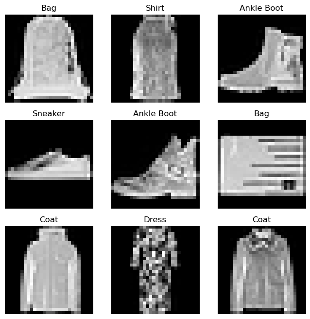
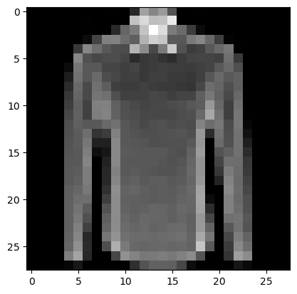
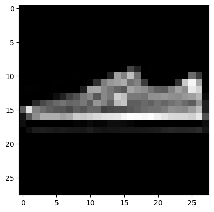
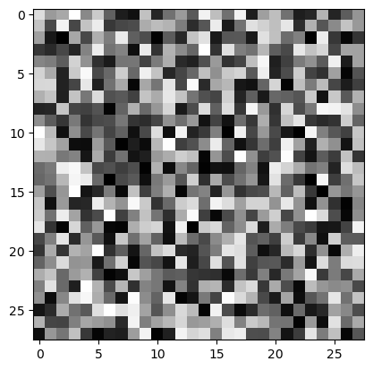
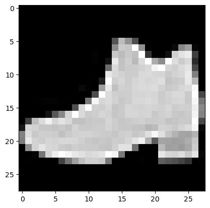
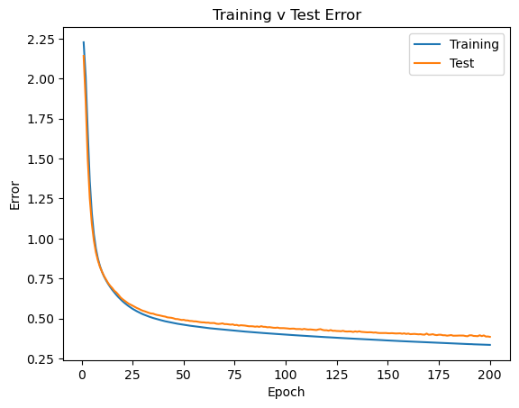

# PyTorch Tutorial Workthrough

Here we work through a basic example in PyTorch. It is the example used in the [PyTorch Tutorial](https://pytorch.org/tutorials/beginner/basics/intro.html). The material heavily relies on the excellent material in that tutorial. The presentation is similar but with a slightly different emphasis. In particular this is written from the perspective of an econometrician and some parallels and differences to traditional econometric techniques will be pointed out.


## Load some libraries


```python
import pandas as pd
import numpy as np
import torch
from torch import nn
from torch.utils.data import Dataset
from torchvision import datasets
from torchvision.transforms import ToTensor, Lambda
from datetime import datetime
import torchvision.models as models
import matplotlib.pyplot as plt
```

## Tensors

The PyTorch library expects data inputs as tensors. For example, here we load some inflation data. This example will actually not work with inflation data, but this is just to get your thinking about the data structure going.


```python
# Load the data
data = pd.read_csv('datasets/CPALTT01USM657N.csv')
data.tail()
data['DATE'] = pd.to_datetime(data['DATE'])
data.set_index('DATE', inplace=True)
data.rename(columns={'CPALTT01USM657N': 'inflation'})
```


<div>
<style scoped>
    .dataframe tbody tr th:only-of-type {
        vertical-align: middle;
    }

    .dataframe tbody tr th {
        vertical-align: top;
    }

    .dataframe thead th {
        text-align: right;
    }
</style>
<table border="1" class="dataframe">
  <thead>
    <tr style="text-align: right;">
      <th></th>
      <th>inflation</th>
    </tr>
    <tr>
      <th>DATE</th>
      <th></th>
    </tr>
  </thead>
  <tbody>
    <tr>
      <th>1960-01-01</th>
      <td>-0.340136</td>
    </tr>
    <tr>
      <th>1960-01-02</th>
      <td>0.341297</td>
    </tr>
    <tr>
      <th>1960-01-03</th>
      <td>0.000000</td>
    </tr>
    <tr>
      <th>1960-01-04</th>
      <td>0.340136</td>
    </tr>
    <tr>
      <th>1960-01-05</th>
      <td>0.000000</td>
    </tr>
    <tr>
      <th>...</th>
      <td>...</td>
    </tr>
    <tr>
      <th>2023-01-03</th>
      <td>0.331073</td>
    </tr>
    <tr>
      <th>2023-01-04</th>
      <td>0.505904</td>
    </tr>
    <tr>
      <th>2023-01-05</th>
      <td>0.251844</td>
    </tr>
    <tr>
      <th>2023-01-06</th>
      <td>0.322891</td>
    </tr>
    <tr>
      <th>2023-01-07</th>
      <td>0.190752</td>
    </tr>
  </tbody>
</table>
<p>763 rows × 1 columns</p>
</div>


These can be transformed into a tensor like so, where we use the `values()` property of the dataframe. The resulting tensor has properties `shape` and `type` which give you the relevant shape and type information.


```python
tensor = torch.tensor(data.values)
tensor.dtype
tensor.shape

```


    torch.Size([763, 1])


Tensors are basically multi-dimensional matrices and you can do arithmatic with these. Find a [list of operations](https://pytorch.org/docs/stable/torch.html) to see what is available. In this example we will not work with these inflation data any longer, but we wanted to show that data you are very familiar with can easily be turned into tensor data. This is important as the `torch` package we will use for estimating neural network models, does require the use of tensors.

## Example data

To follow the example in the PyTorch tutorial we need to load the Fashion-MNIST dataset. This dataset is already in the right format and we obtain a training and a testing portion for the dataset.


```python
training_data = datasets.FashionMNIST(
    root="data",
    train=True,
    download=True,
    transform=ToTensor()
)

test_data = datasets.FashionMNIST(
    root="data",
    train=False,
    download=True,
    transform=ToTensor()
)
```

This split the dataset into a set of 60,000 images to train the network and a set of 10,000 images to evaluate the quality of the dataset.


```python
len(training_data)
len(test_data)
```


    60000


These are image data, for instance the first image `training_data[1]` gives you information on the 28x28 pixels of an image.


```python
training_data[1]
```


    (tensor([[[0.0000, 0.0000, 0.0000, 0.0000, 0.0000, 0.0039, 0.0000, 0.0000,
               0.0000, 0.0000, 0.1608, 0.7373, 0.4039, 0.2118, 0.1882, 0.1686,
               0.3412, 0.6588, 0.5216, 0.0627, 0.0000, 0.0000, 0.0000, 0.0000,
               0.0000, 0.0000, 0.0000, 0.0000],
              [0.0000, 0.0000, 0.0000, 0.0039, 0.0000, 0.0000, 0.0000, 0.1922,
               0.5333, 0.8588, 0.8471, 0.8941, 0.9255, 1.0000, 1.0000, 1.0000,
               1.0000, 0.8510, 0.8431, 0.9961, 0.9059, 0.6275, 0.1765, 0.0000,
               0.0000, 0.0000, 0.0000, 0.0000],
              [0.0000, 0.0000, 0.0000, 0.0000, 0.0000, 0.0549, 0.6902, 0.8706,
               0.8784, 0.8314, 0.7961, 0.7765, 0.7686, 0.7843, 0.8431, 0.8000,
               0.7922, 0.7882, 0.7882, 0.7882, 0.8196, 0.8549, 0.8784, 0.6431,
               0.0000, 0.0000, 0.0000, 0.0000],
              [0.0000, 0.0000, 0.0000, 0.0000, 0.0000, 0.7373, 0.8588, 0.7843,
               0.7765, 0.7922, 0.7765, 0.7804, 0.7804, 0.7882, 0.7686, 0.7765,
               0.7765, 0.7843, 0.7843, 0.7843, 0.7843, 0.7882, 0.7843, 0.8824,
               0.1608, 0.0000, 0.0000, 0.0000],
              [0.0000, 0.0000, 0.0000, 0.0000, 0.2000, 0.8588, 0.7804, 0.7961,
               0.7961, 0.8314, 0.9333, 0.9725, 0.9804, 0.9608, 0.9765, 0.9647,
               0.9686, 0.9882, 0.9725, 0.9216, 0.8118, 0.7961, 0.7961, 0.8706,
               0.5490, 0.0000, 0.0000, 0.0000],
              [0.0000, 0.0000, 0.0000, 0.0000, 0.4549, 0.8863, 0.8078, 0.8000,
               0.8118, 0.8000, 0.3961, 0.2941, 0.1843, 0.2863, 0.1882, 0.1961,
               0.1765, 0.2000, 0.2471, 0.4431, 0.8706, 0.7922, 0.8078, 0.8627,
               0.8784, 0.0000, 0.0000, 0.0000],
              [0.0000, 0.0000, 0.0000, 0.0000, 0.7843, 0.8706, 0.8196, 0.7961,
               0.8431, 0.7843, 0.0000, 0.2745, 0.3843, 0.0000, 0.4039, 0.2314,
               0.2667, 0.2784, 0.1922, 0.0000, 0.8588, 0.8078, 0.8392, 0.8235,
               0.9804, 0.1490, 0.0000, 0.0000],
              [0.0000, 0.0000, 0.0000, 0.0000, 0.9686, 0.8549, 0.8314, 0.8235,
               0.8431, 0.8392, 0.0000, 0.9961, 0.9529, 0.5451, 1.0000, 0.6824,
               0.9843, 1.0000, 0.8039, 0.0000, 0.8431, 0.8510, 0.8392, 0.8157,
               0.8627, 0.3725, 0.0000, 0.0000],
              [0.0000, 0.0000, 0.0000, 0.1765, 0.8863, 0.8392, 0.8392, 0.8431,
               0.8784, 0.8039, 0.0000, 0.1647, 0.1373, 0.2353, 0.0627, 0.0667,
               0.0471, 0.0510, 0.2745, 0.0000, 0.7412, 0.8471, 0.8314, 0.8078,
               0.8314, 0.6118, 0.0000, 0.0000],
              [0.0000, 0.0000, 0.0000, 0.6431, 0.9216, 0.8392, 0.8275, 0.8627,
               0.8471, 0.7882, 0.2039, 0.2784, 0.3490, 0.3686, 0.3255, 0.3059,
               0.2745, 0.2980, 0.3608, 0.3412, 0.8078, 0.8118, 0.8706, 0.8353,
               0.8588, 0.8157, 0.0000, 0.0000],
              [0.0000, 0.0000, 0.0000, 0.4157, 0.7333, 0.8745, 0.9294, 0.9725,
               0.8275, 0.7765, 0.9882, 0.9804, 0.9725, 0.9608, 0.9725, 0.9882,
               0.9922, 0.9804, 0.9882, 0.9373, 0.7882, 0.8314, 0.8824, 0.8431,
               0.7569, 0.4431, 0.0000, 0.0000],
              [0.0000, 0.0000, 0.0000, 0.0000, 0.0000, 0.0667, 0.2118, 0.6235,
               0.8706, 0.7569, 0.8157, 0.7529, 0.7725, 0.7843, 0.7843, 0.7843,
               0.7843, 0.7882, 0.7961, 0.7647, 0.8235, 0.6471, 0.0000, 0.0000,
               0.0000, 0.0000, 0.0000, 0.0000],
              [0.0000, 0.0000, 0.0000, 0.0000, 0.0000, 0.0000, 0.0000, 0.1843,
               0.8824, 0.7529, 0.8392, 0.7961, 0.8078, 0.8000, 0.8000, 0.8039,
               0.8078, 0.8000, 0.8314, 0.7725, 0.8549, 0.4196, 0.0000, 0.0000,
               0.0000, 0.0000, 0.0000, 0.0000],
              [0.0000, 0.0000, 0.0000, 0.0000, 0.0039, 0.0235, 0.0000, 0.1804,
               0.8314, 0.7647, 0.8314, 0.7922, 0.8078, 0.8039, 0.8000, 0.8039,
               0.8078, 0.8000, 0.8314, 0.7843, 0.8549, 0.3569, 0.0000, 0.0118,
               0.0039, 0.0000, 0.0000, 0.0000],
              [0.0000, 0.0000, 0.0000, 0.0000, 0.0000, 0.0039, 0.0000, 0.0431,
               0.7725, 0.7804, 0.8039, 0.7922, 0.8039, 0.8078, 0.8000, 0.8039,
               0.8118, 0.8000, 0.8039, 0.8039, 0.8549, 0.3020, 0.0000, 0.0196,
               0.0000, 0.0000, 0.0000, 0.0000],
              [0.0000, 0.0000, 0.0000, 0.0000, 0.0000, 0.0118, 0.0000, 0.0078,
               0.7490, 0.7765, 0.7882, 0.8039, 0.8078, 0.8039, 0.8039, 0.8078,
               0.8196, 0.8078, 0.7804, 0.8196, 0.8588, 0.2902, 0.0000, 0.0196,
               0.0000, 0.0000, 0.0000, 0.0000],
              [0.0000, 0.0000, 0.0000, 0.0000, 0.0000, 0.0078, 0.0000, 0.0000,
               0.7373, 0.7725, 0.7843, 0.8118, 0.8118, 0.8000, 0.8118, 0.8118,
               0.8235, 0.8157, 0.7765, 0.8118, 0.8667, 0.2824, 0.0000, 0.0157,
               0.0000, 0.0000, 0.0000, 0.0000],
              [0.0000, 0.0000, 0.0000, 0.0000, 0.0000, 0.0078, 0.0000, 0.0000,
               0.8431, 0.7765, 0.7961, 0.8078, 0.8157, 0.8039, 0.8118, 0.8118,
               0.8235, 0.8157, 0.7843, 0.7922, 0.8706, 0.2941, 0.0000, 0.0157,
               0.0000, 0.0000, 0.0000, 0.0000],
              [0.0000, 0.0000, 0.0000, 0.0000, 0.0000, 0.0039, 0.0000, 0.0000,
               0.8314, 0.7765, 0.8196, 0.8078, 0.8196, 0.8078, 0.8157, 0.8118,
               0.8275, 0.8078, 0.8039, 0.7765, 0.8667, 0.3137, 0.0000, 0.0118,
               0.0000, 0.0000, 0.0000, 0.0000],
              [0.0000, 0.0000, 0.0000, 0.0000, 0.0000, 0.0039, 0.0000, 0.0000,
               0.8000, 0.7882, 0.8039, 0.8157, 0.8118, 0.8039, 0.8275, 0.8039,
               0.8235, 0.8235, 0.8196, 0.7647, 0.8667, 0.3765, 0.0000, 0.0118,
               0.0000, 0.0000, 0.0000, 0.0000],
              [0.0000, 0.0000, 0.0000, 0.0000, 0.0000, 0.0039, 0.0000, 0.0000,
               0.7922, 0.7882, 0.8039, 0.8196, 0.8118, 0.8039, 0.8353, 0.8078,
               0.8235, 0.8196, 0.8235, 0.7608, 0.8510, 0.4118, 0.0000, 0.0078,
               0.0000, 0.0000, 0.0000, 0.0000],
              [0.0000, 0.0000, 0.0000, 0.0000, 0.0000, 0.0039, 0.0000, 0.0000,
               0.8000, 0.8000, 0.8039, 0.8157, 0.8118, 0.8039, 0.8431, 0.8118,
               0.8235, 0.8157, 0.8275, 0.7569, 0.8353, 0.4510, 0.0000, 0.0078,
               0.0000, 0.0000, 0.0000, 0.0000],
              [0.0000, 0.0000, 0.0000, 0.0000, 0.0000, 0.0000, 0.0000, 0.0000,
               0.8000, 0.8118, 0.8118, 0.8157, 0.8078, 0.8078, 0.8431, 0.8235,
               0.8235, 0.8118, 0.8314, 0.7647, 0.8235, 0.4627, 0.0000, 0.0078,
               0.0000, 0.0000, 0.0000, 0.0000],
              [0.0000, 0.0000, 0.0000, 0.0000, 0.0000, 0.0039, 0.0000, 0.0000,
               0.7765, 0.8157, 0.8157, 0.8157, 0.8000, 0.8118, 0.8314, 0.8314,
               0.8235, 0.8118, 0.8275, 0.7686, 0.8118, 0.4745, 0.0000, 0.0039,
               0.0000, 0.0000, 0.0000, 0.0000],
              [0.0000, 0.0000, 0.0000, 0.0000, 0.0000, 0.0039, 0.0000, 0.0000,
               0.7765, 0.8235, 0.8118, 0.8157, 0.8078, 0.8196, 0.8353, 0.8314,
               0.8275, 0.8118, 0.8235, 0.7725, 0.8118, 0.4863, 0.0000, 0.0039,
               0.0000, 0.0000, 0.0000, 0.0000],
              [0.0000, 0.0000, 0.0000, 0.0000, 0.0000, 0.0000, 0.0000, 0.0000,
               0.6745, 0.8235, 0.7961, 0.7882, 0.7804, 0.8000, 0.8118, 0.8039,
               0.8000, 0.7882, 0.8039, 0.7725, 0.8078, 0.4980, 0.0000, 0.0000,
               0.0000, 0.0000, 0.0000, 0.0000],
              [0.0000, 0.0000, 0.0000, 0.0000, 0.0000, 0.0000, 0.0000, 0.0000,
               0.7373, 0.8667, 0.8392, 0.9176, 0.9255, 0.9333, 0.9569, 0.9569,
               0.9569, 0.9412, 0.9529, 0.8392, 0.8784, 0.6353, 0.0000, 0.0078,
               0.0000, 0.0000, 0.0000, 0.0000],
              [0.0000, 0.0000, 0.0000, 0.0000, 0.0000, 0.0039, 0.0000, 0.0000,
               0.5451, 0.5725, 0.5098, 0.5294, 0.5294, 0.5373, 0.4902, 0.4863,
               0.4902, 0.4745, 0.4667, 0.4471, 0.5098, 0.2980, 0.0000, 0.0000,
               0.0000, 0.0000, 0.0000, 0.0000]]]),
     0)


We can also visualise these images


```python
labels_map = {
    0: "T-Shirt",
    1: "Trouser",
    2: "Pullover",
    3: "Dress",
    4: "Coat",
    5: "Sandal",
    6: "Shirt",
    7: "Sneaker",
    8: "Bag",
    9: "Ankle Boot",
}
figure = plt.figure(figsize=(8, 8))
cols, rows = 3, 3
for i in range(1, cols * rows + 1):
    sample_idx = torch.randint(len(training_data), size=(1,)).item()
    img, label = training_data[sample_idx]
    figure.add_subplot(rows, cols, i)
    plt.title(labels_map[label])
    plt.axis("off")
    plt.imshow(img.squeeze(), cmap="gray")
plt.show()
```


    

    


We now have the data avaialable in `test_data` and `training_data`. For certain operations it will turn out to be useful to access the data via the DataLoader. This will enable access samples of data.


```python
from torch.utils.data import DataLoader

train_dataloader = DataLoader(training_data, batch_size=64, shuffle=True)
test_dataloader = DataLoader(test_data, batch_size=64, shuffle=True)
```

We indicated above that, if iterating through the data, we get random items. Each item has an image and a label.


```python
train_features, train_labels = next(iter(train_dataloader))
print(f"Feature batch shape: {train_features.size()}")
print(f"Labels batch shape: {train_labels.size()}")
img = train_features[0].squeeze()
label = train_labels[0]
plt.imshow(img, cmap="gray")
plt.show()
print(f"Label: {label}")
```

    Feature batch shape: torch.Size([64, 1, 28, 28])
    Labels batch shape: torch.Size([64])
    


    

    


    Label: 6
    


```python
img, label = training_data[11]
```

## Data transformations

Neural Network models need data input in very controlled scales. Examples are standardised variables (mean 0 and variance 1) or data mapped into a $[0,1]$ interval. In fact, when we imported the Fashion data earlier, we called `transform=ToTensor()`. This ensured that the pixel information was mapped into the $[0,1]$ intervall. The `target` variable, which is the label, however, came as an integer in $[0,9]$. By reloading the data with the `target_transform` as below, we change the label into 10 indicator variables with all but one taking the value 0.


```python
ds_train = datasets.FashionMNIST(
    root="data",
    train=True,
    download=True,
    transform=ToTensor(),
    target_transform=Lambda(lambda y: torch.zeros(10, dtype=torch.float).scatter_(0, torch.tensor(y), value=1))
)

ds_test = datasets.FashionMNIST(
    root="data",
    train=False,
    download=True,
    transform=ToTensor(),
    target_transform=Lambda(lambda y: torch.zeros(10, dtype=torch.float).scatter_(0, torch.tensor(y), value=1))
)
```

Let us extract the 15th item out of `ds_train`, show it and see what type of item it is.


```python
img, label = ds_train[14]
img = img.squeeze()
plt.imshow(img, cmap="gray")
plt.show()
print(f"Label: {label}")
```


    

    


    Label: tensor([0., 0., 0., 0., 0., 0., 0., 1., 0., 0.])
    

You can see that the third last indicator variable is 1. That corresponds to label 7, a sneaker.

## Build the Model

Now that the data are prepared we need to build the model. This is done using the 


```python
class NeuralNetwork(nn.Module):
    def __init__(self):
        super().__init__()
        self.flatten = nn.Flatten()
        self.linear_relu_stack = nn.Sequential(
            nn.Linear(28*28, 512),
            nn.ReLU(),
            nn.Linear(512, 512),
            nn.ReLU(),
            nn.Linear(512, 10),
        )

    def forward(self, x):
        x = self.flatten(x)
        logits = self.linear_relu_stack(x)
        return logits
```

We will return to the details of the above setup a little later. For now just accept it.

But what is useful to understand what the above code did. It defined a `class` called `NeuralNetwork`. This will allow us to soon define a particular object (in computing speak an "instance" of that type of object) of that class. More on this later. 

Estimating, or training in the language of machine learning, a neural network model can by computing intensive. So we want to use the best possible hardware to do so. The following bit of code checks whether you have any special resources available. If not, then your computer's CPU will be used.


```python
device = (
    "cuda"
    if torch.cuda.is_available()
    else "mps"
    if torch.backends.mps.is_available()
    else "cpu"
)
print(f"Using {device} device")
```

    Using cpu device
    

Now we shall define one instance of the `NeuralNetwork` type of objects, and we call it `model`.


```python
model = NeuralNetwork().to(device)
print(model)
```

    NeuralNetwork(
      (flatten): Flatten(start_dim=1, end_dim=-1)
      (linear_relu_stack): Sequential(
        (0): Linear(in_features=784, out_features=512, bias=True)
        (1): ReLU()
        (2): Linear(in_features=512, out_features=512, bias=True)
        (3): ReLU()
        (4): Linear(in_features=512, out_features=10, bias=True)
      )
    )
    

You can see that the model eventually maps the 784 (28x28 pixels) into 10 output items (the 10 different labels). In other words, we feed in an image (as defined by 728 pixels) and we receive information in terms of 10 outputs (the 10 possible labels).

Let us now define a random image and then we print it.


```python
X = torch.rand(1, 28, 28, device=device)
plt.imshow(X.squeeze(), cmap="gray")
plt.show()

```


    

    


So this is just noise. We shouldn't expect to see any particular item of clothing in here. But anyways, let's see whether our Neural Network can detect anything.


```python

logits = model(X)
pred_probab = nn.Softmax(dim=1)(logits)
print(pred_probab)
```

    tensor([[0.0955, 0.0983, 0.0974, 0.0995, 0.0953, 0.0941, 0.1086, 0.1120, 0.1022,
             0.0971]], grad_fn=<SoftmaxBackward0>)
    

What you see here are the predicted probabilities for each of the 10 item classes (from t-shirt to ankle boots). You can see that these probabilities are all between 8 and 11% and in fact they sum to 1. This is not surprising as the random image does not look anythink like any of the items in our list. The max prob here is the probability of 10.55% for a bag.

Let's see how the model does with one of our images from the test dataset (`ds_test`). We will pick the 15th image from the training dataset. We'll first print the image.


```python
img, label = ds_train[15]
img = img.squeeze()
plt.imshow(img, cmap="gray")
plt.show()
print(f"Label: {label}")
```


    

    


    Label: tensor([0., 0., 0., 0., 0., 0., 0., 0., 0., 1.])
    

This is an image of an ankle boot. Now we feed this into our network. Will it identify the picture as an ankle boot? `ds_test[15]` picks the 15th item but there are two elements, the image as the first element (`[0]`) and the label as the second element (`[1]`). So `ds_test[15][0]` picks the image only as we feed it into `model`


```python

logits = model(ds_test[15][0])
pred_probab = nn.Softmax(dim=1)(logits)
print(pred_probab)
```

    tensor([[0.0961, 0.1032, 0.0987, 0.0951, 0.1032, 0.0966, 0.1068, 0.1069, 0.0997,
             0.0936]], grad_fn=<SoftmaxBackward0>)
    

The result is basically as for the random image. All labels have a probability around 10%. Why is that. Well, so far we only initiated a network architecture (which includes some random model coefficients). The network has not seen any data yet which it could use to optimise the parameters such that it recognises an ankle boot.

In fact you can see what the parameters for the model are (as we initialised it):


```python
for name, param in model.named_parameters():
    print(f"Layer: {name} | Size: {param.size()} | Values : {param[:2]} \n")

```

    Layer: linear_relu_stack.0.weight | Size: torch.Size([512, 784]) | Values : tensor([[ 0.0125, -0.0350, -0.0087,  ...,  0.0161,  0.0084, -0.0049],
            [ 0.0058, -0.0292,  0.0140,  ...,  0.0200, -0.0187, -0.0088]],
           grad_fn=<SliceBackward0>) 
    
    Layer: linear_relu_stack.0.bias | Size: torch.Size([512]) | Values : tensor([-0.0337, -0.0068], grad_fn=<SliceBackward0>) 
    
    Layer: linear_relu_stack.2.weight | Size: torch.Size([512, 512]) | Values : tensor([[ 0.0048,  0.0296, -0.0355,  ...,  0.0434, -0.0135, -0.0408],
            [ 0.0405, -0.0185,  0.0233,  ..., -0.0094, -0.0402, -0.0103]],
           grad_fn=<SliceBackward0>) 
    
    Layer: linear_relu_stack.2.bias | Size: torch.Size([512]) | Values : tensor([-0.0322, -0.0193], grad_fn=<SliceBackward0>) 
    
    Layer: linear_relu_stack.4.weight | Size: torch.Size([10, 512]) | Values : tensor([[ 0.0253, -0.0168, -0.0208,  ..., -0.0061,  0.0268, -0.0401],
            [-0.0283, -0.0097,  0.0375,  ..., -0.0025,  0.0085,  0.0235]],
           grad_fn=<SliceBackward0>) 
    
    Layer: linear_relu_stack.4.bias | Size: torch.Size([10]) | Values : tensor([-0.0272, -0.0135], grad_fn=<SliceBackward0>) 
    
    

In fact there are an awful lot of parameters: $(784*512)+ 512+(512*512)+512+(512*10)+10 =669,706$. Almost $700,000$ parameters. The number is a result of the model architecture we defined as we defined the `NeuralNetwork` class. Let us look at a graphical representation of what we build.

We start with an image that is represented by 784 pieces of information, say $X_i$ for $i = 1,..., 784. (#0)

Each of the units in the first hidden layer (#1) represents a linear combination of these 784 pieces of information into a unit in the first hidden layer, think, $Lin^{(1)}_k=\sum^{784}_{i=1}\omega^{(1)}_{ki}X_i$ for the $k$ th of these units. That means that into each of these units we have 784 values and a parameter for each, and then you find 512 units. 

Each of these units you can think of as a function which combines the linear combination of all the image information ($Lin^{(1)}_k$) into an output $Lout^{(1)}_k=g(\omega^{(1)}_{k0}+Lin^{(1)}_k)$. This requires another parameter for each unit $k$, $\omega^{(1)}_{k0}$ and a function $g()$. In the setup we set this function to be a rectified linear activation function (`nn.ReLU()`). This is an extremely simple function of the form $g(x)=max(0,x)$.

The 2nd hidden layer (#2) functions very much in the same manner. All inputs (= all outputs from the previous layer) are linearily combined into the input for the $k$th unit in the second layer, $Lin^{(2)}_k=\sum^{512}_{i=1}\omega^{(2)}_{ki}Lout^{(1)}_i$. This implies that there are $512*512$ parameters ($\omega^{(2)}_{ki}$) at this stage. Again, as we specified in our class definition, the function that combines these into an output for unit $k$ is `nn.ReLU()`, $Lout^{(2)}_k=g(\omega^{(2)}_{k0}+Lin^{(2)}_k)$. This requires 512 additional parameters, $\omega^{(2)}_{k0}$.

Finally, layer #3 defines the model outputs. Here we have 10, as specified in the class setup (`nn.Linear(512, 10)`). Each of these is a linear combination of the 512 outputs from layer 2, $Y_k=\sum^{512}_{i=1}\omega^{(o)}_{ki}Lout^{(2)}_i$. As we have 10 such outputs, this delivers $10*512$ additional parameters.


So we have almost $700,000$ parameters and initially they are all chosen to take some random values. We shouldn't be surprised that the model was unable to distinguish an ankle boot from a t-shirt.

## Estimate/Optimise/Train the model

We now turn attention to the model optimisation. An econometrician would call this parameter estimation, in data science this is typically called the training o fthe model.

Recall that earlier, we initiated an instance of our neural network, `model`, by calling the line


```python
model = NeuralNetwork().to(device)
```

Any code after that line was just for illustration purposes of the networks working. So let's go back to the stage where we just initiated `model`. As discussed before the model will have been initiated with some random parameters.

In order to find the best parameters that allow the model to differentiate an ankle boot from a t-shirt we will need to feed the network some data, we call this this the training data set, `ds_train`, for which we know what categories of items they are. The parameters are adjusted to keep improving the model's categorisation of these data. This is a nonlinear optimisation process, in other words it is an iterative process which potentially never ends. 

To make this a feasible process we have to give Python (or better `torch`) a few instructions for this process. These instructions come in the form of what is commonly called hyperparameters. Typical hyperparameters are

* Number of epochs, or number of parameter improvement iterations 
* Batch size, this tells torch how many pictures to feed into the model in order to find the next improvement
* Learning rate, this instructs torch how quickly to update parameters

We adopt the same values chosen in the Torch tutorial


```python
learning_rate = 1e-3
batch_size = 64
epochs = 5
```

Choosing these differently will give you slightly different results. However, in the end, the idea is that these should be chosen such that the results are not sensitive to sensible changes in tehse parameters.

There are some further choices to be made, namely the loss function and the algorithm.

### Loss function

As econometricians we are familiar with loss functions like the residual sum of squares (which we aim to minimise) or the (log-)likelihood function (which we aim to maximise). Both of these are available to users. Here however we use a different loss function called the `nn.CrossEntropyLoss`. In effect we are comparing two discrete distributions. The real outcome, say of our test ankle boot is a 1x10 vector of values with all but the last element being a 0, the last being equal to 1. Think of this as a discrete distribution.

As you have seen, the output of the neural network we build is also a 1x10 vector of probabilities. Ideally we wish that the network predicts the right label (high probability on ankle boot and close to 0 probability for the other labels). Therefore, the closer the output vector is to the input label vector, the better our model does. 

The `nn.CrossEntropyLoss` loss function can be used to compare such vectors.


```python
# Initialize the loss function
loss_fn = nn.CrossEntropyLoss()
```

### Optimisation algorithm

The process of updating the parameters (`model.parameters()`) to improve the model is an iterative one and we will have to ask `torch` to use one of the algorithms implemented in the package. Below we are using `torch.optim` and in particular we use the stochastic gradient descent method (`.SGD`). Check out the [torch.optim documentation](https://pytorch.org/docs/stable/optim.html) to see a list of the implemented algorithms. Algorithms need some parameters setting and this one needs a learning rate, one of the hyperparameters listed above.


```python
optimizer = torch.optim.SGD(model.parameters(), lr=learning_rate)
```

When optimising parameters in a neural network, there is always the challenge of avoiding over-fitting. As discussed before, this "simple" neural network is still a highly complex and nonlinear model with almost 700,000 parameters. If left unconstrained, we would be able to achieve an almost perfect fit for our set of 60,000 images in the training dataset. But that is not really the challenge at hand. The challenge is to correctly categorise unseen images. This is why 10,000 images have been put aside in the test dataset.

This challenge requires a careful interplay between finding the parameters that correctly categorise the data which are presented to the network (with known categories/labels), but at the same time ensuring that the model does not specialise too much on the presented set of images. This is done by evaluating when improvements start to only improve the fit in the training dataset but do not any longer improve the predictions in the test dataset.

In order to achieve this we need to define the following two functions. First, a training step (`train_loop`) which uses the 60,000 images in the dataset (and their correct labels) to find improvements to teh parameter values. Second, an evaluation/test step (`test_loop`). This evaluation step checks how well the model with the updated parameters from the training step, predict the labels of the 10,000 images in the test dataset. This step does not change the network parameters. We will be iterating between the two. We should expect the training step to always lead to improvements in the fit of the training dataset. In terms of predicting the training dataset we should initially also expect improvements, but eventually we shoudl expect no further improvements. This is the moment when the network begins to over-fit to the data in the training dataset. This is is when we can stop the training steps.


```python
def train_loop(dataloader, model, loss_fn, optimizer):
    size = len(dataloader.dataset)
    # Set the model to training mode - important for batch normalization and dropout layers
    # Unnecessary in this situation but added for best practices
    model.train()
    train_loss = 0
    num_batches = len(dataloader)
    
    for batch, (X, y) in enumerate(dataloader):
        # Compute prediction and loss
        pred = model(X)
        loss = loss_fn(pred, y)
        train_loss += loss.item()

        # Backpropagation
        loss.backward()
        optimizer.step()
        optimizer.zero_grad()

        if batch % 100 == 0:
            loss, current = loss.item(), (batch + 1) * len(X)
            print(f"loss: {loss:>7f}  [{current:>5d}/{size:>5d}]")
            
    train_loss /= num_batches
    print(f"Training:  Avg loss: {train_loss:>8f} \n")
    
    return train_loss


def test_loop(dataloader, model, loss_fn):
    # Set the model to evaluation mode - important for batch normalization and dropout layers
    # Unnecessary in this situation but added for best practices
    model.eval()
    size = len(dataloader.dataset)
    num_batches = len(dataloader)
    test_loss, correct = 0, 0

    # Evaluating the model with torch.no_grad() ensures that no gradients are computed during test mode
    # also serves to reduce unnecessary gradient computations and memory usage for tensors with requires_grad=True
    with torch.no_grad():
        for X, y in dataloader:
            pred = model(X)
            test_loss += loss_fn(pred, y).item()
            correct += (pred.argmax(1) == y).type(torch.float).sum().item()

    test_loss /= num_batches
    correct /= size
    print(f"Test Error: \n Accuracy: {(100*correct):>0.1f}%, Avg loss: {test_loss:>8f} \n")
    
    return test_loss
```

Now that the functions for the training and evaluation step are written we can just call them iteratively. Each training step uses all 60,000 data (in batches of 64) to optimise the parameters and then each evaluation step uses all 10,000 images to test the quality of the model.

As we go through this loop we save the loss functions (`save_loss`) for the training and test data such that we can afterwards look at their development as we cycle through each of these steps (called epoch).


```python
loss_fn = nn.CrossEntropyLoss()
optimizer = torch.optim.SGD(model.parameters(), lr=learning_rate)

epochs = 200
save_loss = np.zeros((epochs,3))

for t in range(epochs):
    print(f"Epoch {t+1}\n-------------------------------")
    save_loss[[t],[0]] = t+1
    save_loss[[t],[1]] = train_loop(train_dataloader, model, loss_fn, optimizer)
    save_loss[[t],[2]] = test_loop(test_dataloader, model, loss_fn)
print("Done!")
```

    Epoch 1
    -------------------------------
    loss: 2.298532  [   64/60000]
    loss: 2.289743  [ 6464/60000]
    loss: 2.279294  [12864/60000]
    loss: 2.255660  [19264/60000]
    loss: 2.243678  [25664/60000]
    loss: 2.220732  [32064/60000]
    loss: 2.227350  [38464/60000]
    loss: 2.205025  [44864/60000]
    loss: 2.170919  [51264/60000]
    loss: 2.127726  [57664/60000]
    Training:  Avg loss: 2.227983 
    
    Test Error: 
     Accuracy: 40.0%, Avg loss: 2.142737 
    
    Epoch 2
    -------------------------------
    loss: 2.184294  [   64/60000]
    loss: 2.113731  [ 6464/60000]
    loss: 2.074864  [12864/60000]
    loss: 2.058708  [19264/60000]
    loss: 2.062468  [25664/60000]
    loss: 2.000256  [32064/60000]
    loss: 2.026388  [38464/60000]
    loss: 1.957521  [44864/60000]
    loss: 1.910275  [51264/60000]
    loss: 1.934209  [57664/60000]
    Training:  Avg loss: 2.013925 
    
    Test Error: 
     Accuracy: 56.2%, Avg loss: 1.859512 
    
    Epoch 3
    -------------------------------
    loss: 1.919831  [   64/60000]
    loss: 1.786309  [ 6464/60000]
    loss: 1.852429  [12864/60000]
    loss: 1.749505  [19264/60000]
    loss: 1.697453  [25664/60000]
    loss: 1.666074  [32064/60000]
    loss: 1.612206  [38464/60000]
    loss: 1.550460  [44864/60000]
    loss: 1.616006  [51264/60000]
    loss: 1.549967  [57664/60000]
    Training:  Avg loss: 1.671699 
    
    Test Error: 
     Accuracy: 58.5%, Avg loss: 1.500091 
    
    Epoch 4
    -------------------------------
    loss: 1.448203  [   64/60000]
    loss: 1.470392  [ 6464/60000]
    loss: 1.566669  [12864/60000]
    loss: 1.351499  [19264/60000]
    loss: 1.343482  [25664/60000]
    loss: 1.326560  [32064/60000]
    loss: 1.425466  [38464/60000]
    loss: 1.354166  [44864/60000]
    loss: 1.253878  [51264/60000]
    loss: 1.235223  [57664/60000]
    Training:  Avg loss: 1.360737 
    
    Test Error: 
     Accuracy: 62.7%, Avg loss: 1.252826 
    
    Epoch 5
    -------------------------------
    loss: 1.284077  [   64/60000]
    loss: 1.165842  [ 6464/60000]
    loss: 1.153011  [12864/60000]
    loss: 1.158080  [19264/60000]
    loss: 1.219942  [25664/60000]
    loss: 1.183282  [32064/60000]
    loss: 1.185815  [38464/60000]
    loss: 1.162471  [44864/60000]
    loss: 1.002640  [51264/60000]
    loss: 1.086006  [57664/60000]
    Training:  Avg loss: 1.160068 
    
    Test Error: 
     Accuracy: 63.9%, Avg loss: 1.093596 
    
    Epoch 6
    -------------------------------
    loss: 1.100469  [   64/60000]
    loss: 1.107111  [ 6464/60000]
    loss: 0.940219  [12864/60000]
    loss: 1.203690  [19264/60000]
    loss: 0.938860  [25664/60000]
    loss: 1.019288  [32064/60000]
    loss: 1.031710  [38464/60000]
    loss: 0.931231  [44864/60000]
    loss: 0.859177  [51264/60000]
    loss: 0.971455  [57664/60000]
    Training:  Avg loss: 1.028146 
    
    Test Error: 
     Accuracy: 65.3%, Avg loss: 0.988706 
    
    Epoch 7
    -------------------------------
    loss: 0.945242  [   64/60000]
    loss: 0.996501  [ 6464/60000]
    loss: 1.035764  [12864/60000]
    loss: 0.833000  [19264/60000]
    loss: 0.803923  [25664/60000]
    loss: 1.062509  [32064/60000]
    loss: 0.816259  [38464/60000]
    loss: 0.831740  [44864/60000]
    loss: 0.950867  [51264/60000]
    loss: 0.904064  [57664/60000]
    Training:  Avg loss: 0.937991 
    
    Test Error: 
     Accuracy: 65.8%, Avg loss: 0.913812 
    
    Epoch 8
    -------------------------------
    loss: 0.861781  [   64/60000]
    loss: 0.894671  [ 6464/60000]
    loss: 0.964126  [12864/60000]
    loss: 1.015488  [19264/60000]
    loss: 0.905006  [25664/60000]
    loss: 0.687003  [32064/60000]
    loss: 0.753945  [38464/60000]
    loss: 0.894196  [44864/60000]
    loss: 0.842911  [51264/60000]
    loss: 0.869812  [57664/60000]
    Training:  Avg loss: 0.874258 
    
    Test Error: 
     Accuracy: 67.2%, Avg loss: 0.862455 
    
    Epoch 9
    -------------------------------
    loss: 0.796063  [   64/60000]
    loss: 1.076437  [ 6464/60000]
    loss: 0.857867  [12864/60000]
    loss: 0.793358  [19264/60000]
    loss: 0.918363  [25664/60000]
    loss: 0.676771  [32064/60000]
    loss: 0.894671  [38464/60000]
    loss: 0.834851  [44864/60000]
    loss: 0.849899  [51264/60000]
    loss: 0.731081  [57664/60000]
    Training:  Avg loss: 0.827677 
    
    Test Error: 
     Accuracy: 68.6%, Avg loss: 0.822487 
    
    Epoch 10
    -------------------------------
    loss: 0.949339  [   64/60000]
    loss: 0.584500  [ 6464/60000]
    loss: 0.779696  [12864/60000]
    loss: 0.688902  [19264/60000]
    loss: 0.768254  [25664/60000]
    loss: 0.749628  [32064/60000]
    loss: 0.795666  [38464/60000]
    loss: 0.801303  [44864/60000]
    loss: 0.614506  [51264/60000]
    loss: 0.960770  [57664/60000]
    Training:  Avg loss: 0.791865 
    
    Test Error: 
     Accuracy: 70.5%, Avg loss: 0.791772 
    
    Epoch 11
    -------------------------------
    loss: 0.623366  [   64/60000]
    loss: 1.030589  [ 6464/60000]
    loss: 0.815113  [12864/60000]
    loss: 0.908489  [19264/60000]
    loss: 0.735603  [25664/60000]
    loss: 0.675868  [32064/60000]
    loss: 0.982758  [38464/60000]
    loss: 0.628550  [44864/60000]
    loss: 0.683309  [51264/60000]
    loss: 0.876658  [57664/60000]
    Training:  Avg loss: 0.762631 
    
    Test Error: 
     Accuracy: 71.5%, Avg loss: 0.764867 
    
    Epoch 12
    -------------------------------
    loss: 0.797179  [   64/60000]
    loss: 0.733122  [ 6464/60000]
    loss: 0.758931  [12864/60000]
    loss: 0.735790  [19264/60000]
    loss: 0.665153  [25664/60000]
    loss: 0.811129  [32064/60000]
    loss: 0.691191  [38464/60000]
    loss: 0.762898  [44864/60000]
    loss: 0.880220  [51264/60000]
    loss: 0.779716  [57664/60000]
    Training:  Avg loss: 0.738212 
    
    Test Error: 
     Accuracy: 72.8%, Avg loss: 0.742777 
    
    Epoch 13
    -------------------------------
    loss: 0.670238  [   64/60000]
    loss: 0.664685  [ 6464/60000]
    loss: 0.584924  [12864/60000]
    loss: 0.732356  [19264/60000]
    loss: 0.727411  [25664/60000]
    loss: 0.721036  [32064/60000]
    loss: 0.897042  [38464/60000]
    loss: 0.732634  [44864/60000]
    loss: 0.682275  [51264/60000]
    loss: 0.817855  [57664/60000]
    Training:  Avg loss: 0.716655 
    
    Test Error: 
     Accuracy: 73.7%, Avg loss: 0.721524 
    
    Epoch 14
    -------------------------------
    loss: 0.785921  [   64/60000]
    loss: 0.809043  [ 6464/60000]
    loss: 0.564047  [12864/60000]
    loss: 0.744361  [19264/60000]
    loss: 0.576329  [25664/60000]
    loss: 0.690446  [32064/60000]
    loss: 0.699509  [38464/60000]
    loss: 0.725427  [44864/60000]
    loss: 0.629143  [51264/60000]
    loss: 0.590732  [57664/60000]
    Training:  Avg loss: 0.697290 
    
    Test Error: 
     Accuracy: 74.6%, Avg loss: 0.704287 
    
    Epoch 15
    -------------------------------
    loss: 0.762699  [   64/60000]
    loss: 0.662101  [ 6464/60000]
    loss: 0.663817  [12864/60000]
    loss: 0.648505  [19264/60000]
    loss: 0.720434  [25664/60000]
    loss: 0.652357  [32064/60000]
    loss: 0.632540  [38464/60000]
    loss: 0.738535  [44864/60000]
    loss: 0.492663  [51264/60000]
    loss: 0.644983  [57664/60000]
    Training:  Avg loss: 0.679345 
    
    Test Error: 
     Accuracy: 75.4%, Avg loss: 0.690431 
    
    Epoch 16
    -------------------------------
    loss: 0.568191  [   64/60000]
    loss: 0.714668  [ 6464/60000]
    loss: 0.689558  [12864/60000]
    loss: 0.669038  [19264/60000]
    loss: 0.708230  [25664/60000]
    loss: 0.618782  [32064/60000]
    loss: 0.673686  [38464/60000]
    loss: 0.601638  [44864/60000]
    loss: 0.487470  [51264/60000]
    loss: 0.642209  [57664/60000]
    Training:  Avg loss: 0.663292 
    
    Test Error: 
     Accuracy: 76.4%, Avg loss: 0.673799 
    
    Epoch 17
    -------------------------------
    loss: 0.592583  [   64/60000]
    loss: 0.755441  [ 6464/60000]
    loss: 0.739926  [12864/60000]
    loss: 0.677378  [19264/60000]
    loss: 0.654386  [25664/60000]
    loss: 0.662438  [32064/60000]
    loss: 0.762327  [38464/60000]
    loss: 0.623549  [44864/60000]
    loss: 0.599485  [51264/60000]
    loss: 0.622419  [57664/60000]
    Training:  Avg loss: 0.648064 
    
    Test Error: 
     Accuracy: 77.0%, Avg loss: 0.663109 
    
    Epoch 18
    -------------------------------
    loss: 0.615334  [   64/60000]
    loss: 0.542004  [ 6464/60000]
    loss: 0.679787  [12864/60000]
    loss: 0.725866  [19264/60000]
    loss: 0.605290  [25664/60000]
    loss: 0.566916  [32064/60000]
    loss: 0.662562  [38464/60000]
    loss: 0.631135  [44864/60000]
    loss: 0.524498  [51264/60000]
    loss: 0.555956  [57664/60000]
    Training:  Avg loss: 0.633753 
    
    Test Error: 
     Accuracy: 77.3%, Avg loss: 0.648938 
    
    Epoch 19
    -------------------------------
    loss: 0.667491  [   64/60000]
    loss: 0.515058  [ 6464/60000]
    loss: 0.520290  [12864/60000]
    loss: 0.552431  [19264/60000]
    loss: 0.622699  [25664/60000]
    loss: 0.676777  [32064/60000]
    loss: 0.538169  [38464/60000]
    loss: 0.464249  [44864/60000]
    loss: 0.553061  [51264/60000]
    loss: 0.536799  [57664/60000]
    Training:  Avg loss: 0.620876 
    
    Test Error: 
     Accuracy: 77.9%, Avg loss: 0.632585 
    
    Epoch 20
    -------------------------------
    loss: 0.628431  [   64/60000]
    loss: 0.499238  [ 6464/60000]
    loss: 0.683474  [12864/60000]
    loss: 0.688266  [19264/60000]
    loss: 0.617458  [25664/60000]
    loss: 0.495780  [32064/60000]
    loss: 0.789429  [38464/60000]
    loss: 0.589537  [44864/60000]
    loss: 0.515494  [51264/60000]
    loss: 0.497122  [57664/60000]
    Training:  Avg loss: 0.608695 
    
    Test Error: 
     Accuracy: 78.6%, Avg loss: 0.621169 
    
    Epoch 21
    -------------------------------
    loss: 0.542238  [   64/60000]
    loss: 0.653538  [ 6464/60000]
    loss: 0.793532  [12864/60000]
    loss: 0.670286  [19264/60000]
    loss: 0.741615  [25664/60000]
    loss: 0.522330  [32064/60000]
    loss: 0.440280  [38464/60000]
    loss: 0.611068  [44864/60000]
    loss: 0.561672  [51264/60000]
    loss: 0.556120  [57664/60000]
    Training:  Avg loss: 0.597504 
    
    Test Error: 
     Accuracy: 78.7%, Avg loss: 0.611513 
    
    Epoch 22
    -------------------------------
    loss: 0.467702  [   64/60000]
    loss: 0.451842  [ 6464/60000]
    loss: 0.723985  [12864/60000]
    loss: 0.591683  [19264/60000]
    loss: 0.648059  [25664/60000]
    loss: 0.474802  [32064/60000]
    loss: 0.653512  [38464/60000]
    loss: 0.492108  [44864/60000]
    loss: 0.701906  [51264/60000]
    loss: 0.589475  [57664/60000]
    Training:  Avg loss: 0.587255 
    
    Test Error: 
     Accuracy: 78.9%, Avg loss: 0.602350 
    
    Epoch 23
    -------------------------------
    loss: 0.594063  [   64/60000]
    loss: 0.628489  [ 6464/60000]
    loss: 0.325032  [12864/60000]
    loss: 0.714758  [19264/60000]
    loss: 0.507848  [25664/60000]
    loss: 0.672610  [32064/60000]
    loss: 0.491266  [38464/60000]
    loss: 0.460033  [44864/60000]
    loss: 0.619063  [51264/60000]
    loss: 0.438546  [57664/60000]
    Training:  Avg loss: 0.577481 
    
    Test Error: 
     Accuracy: 79.5%, Avg loss: 0.592881 
    
    Epoch 24
    -------------------------------
    loss: 0.607856  [   64/60000]
    loss: 0.500895  [ 6464/60000]
    loss: 0.703012  [12864/60000]
    loss: 0.613659  [19264/60000]
    loss: 0.531148  [25664/60000]
    loss: 0.441333  [32064/60000]
    loss: 0.621263  [38464/60000]
    loss: 0.667070  [44864/60000]
    loss: 0.396283  [51264/60000]
    loss: 0.592403  [57664/60000]
    Training:  Avg loss: 0.568517 
    
    Test Error: 
     Accuracy: 79.6%, Avg loss: 0.586478 
    
    Epoch 25
    -------------------------------
    loss: 0.648326  [   64/60000]
    loss: 0.587054  [ 6464/60000]
    loss: 0.499688  [12864/60000]
    loss: 0.671928  [19264/60000]
    loss: 0.516193  [25664/60000]
    loss: 0.472166  [32064/60000]
    loss: 0.532750  [38464/60000]
    loss: 0.487506  [44864/60000]
    loss: 0.506655  [51264/60000]
    loss: 0.439543  [57664/60000]
    Training:  Avg loss: 0.560280 
    
    Test Error: 
     Accuracy: 80.0%, Avg loss: 0.579949 
    
    Epoch 26
    -------------------------------
    loss: 0.549302  [   64/60000]
    loss: 0.507599  [ 6464/60000]
    loss: 0.534281  [12864/60000]
    loss: 0.710572  [19264/60000]
    loss: 0.429861  [25664/60000]
    loss: 0.596533  [32064/60000]
    loss: 0.437091  [38464/60000]
    loss: 0.431361  [44864/60000]
    loss: 0.541147  [51264/60000]
    loss: 0.729079  [57664/60000]
    Training:  Avg loss: 0.552573 
    
    Test Error: 
     Accuracy: 80.0%, Avg loss: 0.572596 
    
    Epoch 27
    -------------------------------
    loss: 0.511283  [   64/60000]
    loss: 0.517016  [ 6464/60000]
    loss: 0.612907  [12864/60000]
    loss: 0.410109  [19264/60000]
    loss: 0.543420  [25664/60000]
    loss: 0.659044  [32064/60000]
    loss: 0.544553  [38464/60000]
    loss: 0.539921  [44864/60000]
    loss: 0.761254  [51264/60000]
    loss: 0.406782  [57664/60000]
    Training:  Avg loss: 0.545576 
    
    Test Error: 
     Accuracy: 80.2%, Avg loss: 0.565942 
    
    Epoch 28
    -------------------------------
    loss: 0.627768  [   64/60000]
    loss: 0.697849  [ 6464/60000]
    loss: 0.534019  [12864/60000]
    loss: 0.514086  [19264/60000]
    loss: 0.524095  [25664/60000]
    loss: 0.519459  [32064/60000]
    loss: 0.481594  [38464/60000]
    loss: 0.460370  [44864/60000]
    loss: 0.487014  [51264/60000]
    loss: 0.526797  [57664/60000]
    Training:  Avg loss: 0.538868 
    
    Test Error: 
     Accuracy: 80.7%, Avg loss: 0.560496 
    
    Epoch 29
    -------------------------------
    loss: 0.389162  [   64/60000]
    loss: 0.533802  [ 6464/60000]
    loss: 0.578550  [12864/60000]
    loss: 0.500618  [19264/60000]
    loss: 0.604662  [25664/60000]
    loss: 0.663092  [32064/60000]
    loss: 0.373549  [38464/60000]
    loss: 0.457558  [44864/60000]
    loss: 0.519003  [51264/60000]
    loss: 0.471867  [57664/60000]
    Training:  Avg loss: 0.532741 
    
    Test Error: 
     Accuracy: 80.6%, Avg loss: 0.553829 
    
    Epoch 30
    -------------------------------
    loss: 0.627958  [   64/60000]
    loss: 0.603418  [ 6464/60000]
    loss: 0.596318  [12864/60000]
    loss: 0.597319  [19264/60000]
    loss: 0.520079  [25664/60000]
    loss: 0.385438  [32064/60000]
    loss: 0.540811  [38464/60000]
    loss: 0.435725  [44864/60000]
    loss: 0.422362  [51264/60000]
    loss: 0.443935  [57664/60000]
    Training:  Avg loss: 0.526691 
    
    Test Error: 
     Accuracy: 80.8%, Avg loss: 0.548262 
    
    Epoch 31
    -------------------------------
    loss: 0.444135  [   64/60000]
    loss: 0.665835  [ 6464/60000]
    loss: 0.660750  [12864/60000]
    loss: 0.578654  [19264/60000]
    loss: 0.473765  [25664/60000]
    loss: 0.414590  [32064/60000]
    loss: 0.495708  [38464/60000]
    loss: 0.584465  [44864/60000]
    loss: 0.541048  [51264/60000]
    loss: 0.583207  [57664/60000]
    Training:  Avg loss: 0.521531 
    
    Test Error: 
     Accuracy: 81.1%, Avg loss: 0.544556 
    
    Epoch 32
    -------------------------------
    loss: 0.533246  [   64/60000]
    loss: 0.522221  [ 6464/60000]
    loss: 0.505837  [12864/60000]
    loss: 0.542025  [19264/60000]
    loss: 0.648831  [25664/60000]
    loss: 0.550267  [32064/60000]
    loss: 0.511932  [38464/60000]
    loss: 0.540213  [44864/60000]
    loss: 0.485319  [51264/60000]
    loss: 0.562913  [57664/60000]
    Training:  Avg loss: 0.516483 
    
    Test Error: 
     Accuracy: 81.2%, Avg loss: 0.539831 
    
    Epoch 33
    -------------------------------
    loss: 0.348385  [   64/60000]
    loss: 0.738395  [ 6464/60000]
    loss: 0.603781  [12864/60000]
    loss: 0.471077  [19264/60000]
    loss: 0.521733  [25664/60000]
    loss: 0.523441  [32064/60000]
    loss: 0.655108  [38464/60000]
    loss: 0.439272  [44864/60000]
    loss: 0.352483  [51264/60000]
    loss: 0.681160  [57664/60000]
    Training:  Avg loss: 0.511783 
    
    Test Error: 
     Accuracy: 81.2%, Avg loss: 0.534943 
    
    Epoch 34
    -------------------------------
    loss: 0.398766  [   64/60000]
    loss: 0.655237  [ 6464/60000]
    loss: 0.430160  [12864/60000]
    loss: 0.828920  [19264/60000]
    loss: 0.439598  [25664/60000]
    loss: 0.454108  [32064/60000]
    loss: 0.557259  [38464/60000]
    loss: 0.561691  [44864/60000]
    loss: 0.516948  [51264/60000]
    loss: 0.468143  [57664/60000]
    Training:  Avg loss: 0.507250 
    
    Test Error: 
     Accuracy: 81.3%, Avg loss: 0.531075 
    
    Epoch 35
    -------------------------------
    loss: 0.591575  [   64/60000]
    loss: 0.561601  [ 6464/60000]
    loss: 0.345327  [12864/60000]
    loss: 0.424655  [19264/60000]
    loss: 0.427621  [25664/60000]
    loss: 0.398327  [32064/60000]
    loss: 0.667116  [38464/60000]
    loss: 0.402564  [44864/60000]
    loss: 0.474849  [51264/60000]
    loss: 0.749186  [57664/60000]
    Training:  Avg loss: 0.503095 
    
    Test Error: 
     Accuracy: 81.4%, Avg loss: 0.530257 
    
    Epoch 36
    -------------------------------
    loss: 0.456398  [   64/60000]
    loss: 0.578338  [ 6464/60000]
    loss: 0.634156  [12864/60000]
    loss: 0.636776  [19264/60000]
    loss: 0.479900  [25664/60000]
    loss: 0.511273  [32064/60000]
    loss: 0.545797  [38464/60000]
    loss: 0.534171  [44864/60000]
    loss: 0.375296  [51264/60000]
    loss: 0.579457  [57664/60000]
    Training:  Avg loss: 0.499380 
    
    Test Error: 
     Accuracy: 81.4%, Avg loss: 0.525450 
    
    Epoch 37
    -------------------------------
    loss: 0.440079  [   64/60000]
    loss: 0.596023  [ 6464/60000]
    loss: 0.588442  [12864/60000]
    loss: 0.682499  [19264/60000]
    loss: 0.702867  [25664/60000]
    loss: 0.526552  [32064/60000]
    loss: 0.503294  [38464/60000]
    loss: 0.366795  [44864/60000]
    loss: 0.398253  [51264/60000]
    loss: 0.446442  [57664/60000]
    Training:  Avg loss: 0.495437 
    
    Test Error: 
     Accuracy: 81.6%, Avg loss: 0.521937 
    
    Epoch 38
    -------------------------------
    loss: 0.445099  [   64/60000]
    loss: 0.453704  [ 6464/60000]
    loss: 0.472722  [12864/60000]
    loss: 0.620473  [19264/60000]
    loss: 0.367575  [25664/60000]
    loss: 0.620017  [32064/60000]
    loss: 0.587338  [38464/60000]
    loss: 0.661958  [44864/60000]
    loss: 0.509145  [51264/60000]
    loss: 0.437891  [57664/60000]
    Training:  Avg loss: 0.491954 
    
    Test Error: 
     Accuracy: 81.9%, Avg loss: 0.519837 
    
    Epoch 39
    -------------------------------
    loss: 0.651867  [   64/60000]
    loss: 0.555610  [ 6464/60000]
    loss: 0.513715  [12864/60000]
    loss: 0.281187  [19264/60000]
    loss: 0.449058  [25664/60000]
    loss: 0.462167  [32064/60000]
    loss: 0.666167  [38464/60000]
    loss: 0.471808  [44864/60000]
    loss: 0.580069  [51264/60000]
    loss: 0.506355  [57664/60000]
    Training:  Avg loss: 0.488865 
    
    Test Error: 
     Accuracy: 81.7%, Avg loss: 0.516621 
    
    Epoch 40
    -------------------------------
    loss: 0.427972  [   64/60000]
    loss: 0.487687  [ 6464/60000]
    loss: 0.435091  [12864/60000]
    loss: 0.645026  [19264/60000]
    loss: 0.442070  [25664/60000]
    loss: 0.415334  [32064/60000]
    loss: 0.559285  [38464/60000]
    loss: 0.344563  [44864/60000]
    loss: 0.375805  [51264/60000]
    loss: 0.619541  [57664/60000]
    Training:  Avg loss: 0.485418 
    
    Test Error: 
     Accuracy: 81.8%, Avg loss: 0.513849 
    
    Epoch 41
    -------------------------------
    loss: 0.320613  [   64/60000]
    loss: 0.589153  [ 6464/60000]
    loss: 0.377996  [12864/60000]
    loss: 0.411964  [19264/60000]
    loss: 0.376281  [25664/60000]
    loss: 0.383596  [32064/60000]
    loss: 0.512387  [38464/60000]
    loss: 0.509902  [44864/60000]
    loss: 0.531494  [51264/60000]
    loss: 0.379005  [57664/60000]
    Training:  Avg loss: 0.482343 
    
    Test Error: 
     Accuracy: 81.8%, Avg loss: 0.511641 
    
    Epoch 42
    -------------------------------
    loss: 0.516396  [   64/60000]
    loss: 0.319893  [ 6464/60000]
    loss: 0.408751  [12864/60000]
    loss: 0.726786  [19264/60000]
    loss: 0.403084  [25664/60000]
    loss: 0.539679  [32064/60000]
    loss: 0.464528  [38464/60000]
    loss: 0.514418  [44864/60000]
    loss: 0.452978  [51264/60000]
    loss: 0.494505  [57664/60000]
    Training:  Avg loss: 0.479758 
    
    Test Error: 
     Accuracy: 82.0%, Avg loss: 0.507009 
    
    Epoch 43
    -------------------------------
    loss: 0.404416  [   64/60000]
    loss: 0.237183  [ 6464/60000]
    loss: 0.379559  [12864/60000]
    loss: 0.736608  [19264/60000]
    loss: 0.420855  [25664/60000]
    loss: 0.515755  [32064/60000]
    loss: 0.523773  [38464/60000]
    loss: 0.458461  [44864/60000]
    loss: 0.466719  [51264/60000]
    loss: 0.300011  [57664/60000]
    Training:  Avg loss: 0.476984 
    
    Test Error: 
     Accuracy: 82.0%, Avg loss: 0.505434 
    
    Epoch 44
    -------------------------------
    loss: 0.295450  [   64/60000]
    loss: 0.462097  [ 6464/60000]
    loss: 0.679482  [12864/60000]
    loss: 0.481777  [19264/60000]
    loss: 0.490383  [25664/60000]
    loss: 0.422894  [32064/60000]
    loss: 0.378107  [38464/60000]
    loss: 0.440765  [44864/60000]
    loss: 0.444241  [51264/60000]
    loss: 0.459480  [57664/60000]
    Training:  Avg loss: 0.474526 
    
    Test Error: 
     Accuracy: 82.1%, Avg loss: 0.504213 
    
    Epoch 45
    -------------------------------
    loss: 0.659779  [   64/60000]
    loss: 0.482760  [ 6464/60000]
    loss: 0.508350  [12864/60000]
    loss: 0.501682  [19264/60000]
    loss: 0.449626  [25664/60000]
    loss: 0.449312  [32064/60000]
    loss: 0.350504  [38464/60000]
    loss: 0.428965  [44864/60000]
    loss: 0.448845  [51264/60000]
    loss: 0.412556  [57664/60000]
    Training:  Avg loss: 0.471911 
    
    Test Error: 
     Accuracy: 82.1%, Avg loss: 0.501164 
    
    Epoch 46
    -------------------------------
    loss: 0.393261  [   64/60000]
    loss: 0.397639  [ 6464/60000]
    loss: 0.398137  [12864/60000]
    loss: 0.549782  [19264/60000]
    loss: 0.474174  [25664/60000]
    loss: 0.464824  [32064/60000]
    loss: 0.346024  [38464/60000]
    loss: 0.481695  [44864/60000]
    loss: 0.380709  [51264/60000]
    loss: 0.395363  [57664/60000]
    Training:  Avg loss: 0.469399 
    
    Test Error: 
     Accuracy: 82.3%, Avg loss: 0.496697 
    
    Epoch 47
    -------------------------------
    loss: 0.606119  [   64/60000]
    loss: 0.538122  [ 6464/60000]
    loss: 0.452793  [12864/60000]
    loss: 0.457637  [19264/60000]
    loss: 0.455114  [25664/60000]
    loss: 0.362156  [32064/60000]
    loss: 0.393460  [38464/60000]
    loss: 0.275612  [44864/60000]
    loss: 0.461445  [51264/60000]
    loss: 0.367144  [57664/60000]
    Training:  Avg loss: 0.466973 
    
    Test Error: 
     Accuracy: 82.4%, Avg loss: 0.496276 
    
    Epoch 48
    -------------------------------
    loss: 0.609811  [   64/60000]
    loss: 0.359059  [ 6464/60000]
    loss: 0.588134  [12864/60000]
    loss: 0.434405  [19264/60000]
    loss: 0.414817  [25664/60000]
    loss: 0.406991  [32064/60000]
    loss: 0.507965  [38464/60000]
    loss: 0.488370  [44864/60000]
    loss: 0.576937  [51264/60000]
    loss: 0.357425  [57664/60000]
    Training:  Avg loss: 0.464900 
    
    Test Error: 
     Accuracy: 82.4%, Avg loss: 0.493302 
    
    Epoch 49
    -------------------------------
    loss: 0.338523  [   64/60000]
    loss: 0.520876  [ 6464/60000]
    loss: 0.529586  [12864/60000]
    loss: 0.407384  [19264/60000]
    loss: 0.413046  [25664/60000]
    loss: 0.648664  [32064/60000]
    loss: 0.538430  [38464/60000]
    loss: 0.408102  [44864/60000]
    loss: 0.504493  [51264/60000]
    loss: 0.431288  [57664/60000]
    Training:  Avg loss: 0.462886 
    
    Test Error: 
     Accuracy: 82.5%, Avg loss: 0.490710 
    
    Epoch 50
    -------------------------------
    loss: 0.400128  [   64/60000]
    loss: 0.535007  [ 6464/60000]
    loss: 0.447540  [12864/60000]
    loss: 0.436445  [19264/60000]
    loss: 0.533107  [25664/60000]
    loss: 0.246256  [32064/60000]
    loss: 0.365048  [38464/60000]
    loss: 0.545772  [44864/60000]
    loss: 0.289432  [51264/60000]
    loss: 0.509429  [57664/60000]
    Training:  Avg loss: 0.460647 
    
    Test Error: 
     Accuracy: 82.5%, Avg loss: 0.491504 
    
    Epoch 51
    -------------------------------
    loss: 0.474120  [   64/60000]
    loss: 0.463045  [ 6464/60000]
    loss: 0.489152  [12864/60000]
    loss: 0.367888  [19264/60000]
    loss: 0.311571  [25664/60000]
    loss: 0.455630  [32064/60000]
    loss: 0.509313  [38464/60000]
    loss: 0.624610  [44864/60000]
    loss: 0.414112  [51264/60000]
    loss: 0.385604  [57664/60000]
    Training:  Avg loss: 0.458892 
    
    Test Error: 
     Accuracy: 82.7%, Avg loss: 0.488112 
    
    Epoch 52
    -------------------------------
    loss: 0.410993  [   64/60000]
    loss: 0.604121  [ 6464/60000]
    loss: 0.537265  [12864/60000]
    loss: 0.470522  [19264/60000]
    loss: 0.366119  [25664/60000]
    loss: 0.475463  [32064/60000]
    loss: 0.250416  [38464/60000]
    loss: 0.441595  [44864/60000]
    loss: 0.585680  [51264/60000]
    loss: 0.331575  [57664/60000]
    Training:  Avg loss: 0.456991 
    
    Test Error: 
     Accuracy: 82.7%, Avg loss: 0.487714 
    
    Epoch 53
    -------------------------------
    loss: 0.381970  [   64/60000]
    loss: 0.456165  [ 6464/60000]
    loss: 0.459149  [12864/60000]
    loss: 0.482384  [19264/60000]
    loss: 0.313679  [25664/60000]
    loss: 0.544400  [32064/60000]
    loss: 0.400850  [38464/60000]
    loss: 0.655654  [44864/60000]
    loss: 0.364910  [51264/60000]
    loss: 0.436099  [57664/60000]
    Training:  Avg loss: 0.454896 
    
    Test Error: 
     Accuracy: 82.7%, Avg loss: 0.484523 
    
    Epoch 54
    -------------------------------
    loss: 0.384494  [   64/60000]
    loss: 0.286357  [ 6464/60000]
    loss: 0.233997  [12864/60000]
    loss: 0.491319  [19264/60000]
    loss: 0.423309  [25664/60000]
    loss: 0.453871  [32064/60000]
    loss: 0.360182  [38464/60000]
    loss: 0.417257  [44864/60000]
    loss: 0.396173  [51264/60000]
    loss: 0.481867  [57664/60000]
    Training:  Avg loss: 0.453238 
    
    Test Error: 
     Accuracy: 82.7%, Avg loss: 0.484046 
    
    Epoch 55
    -------------------------------
    loss: 0.352876  [   64/60000]
    loss: 0.515044  [ 6464/60000]
    loss: 0.706136  [12864/60000]
    loss: 0.391102  [19264/60000]
    loss: 0.521491  [25664/60000]
    loss: 0.490059  [32064/60000]
    loss: 0.209970  [38464/60000]
    loss: 0.417378  [44864/60000]
    loss: 0.435987  [51264/60000]
    loss: 0.363384  [57664/60000]
    Training:  Avg loss: 0.451396 
    
    Test Error: 
     Accuracy: 82.7%, Avg loss: 0.481934 
    
    Epoch 56
    -------------------------------
    loss: 0.340688  [   64/60000]
    loss: 0.418613  [ 6464/60000]
    loss: 0.497102  [12864/60000]
    loss: 0.362921  [19264/60000]
    loss: 0.444783  [25664/60000]
    loss: 0.387098  [32064/60000]
    loss: 0.372031  [38464/60000]
    loss: 0.612548  [44864/60000]
    loss: 0.347098  [51264/60000]
    loss: 0.474584  [57664/60000]
    Training:  Avg loss: 0.449584 
    
    Test Error: 
     Accuracy: 82.8%, Avg loss: 0.481721 
    
    Epoch 57
    -------------------------------
    loss: 0.424630  [   64/60000]
    loss: 0.469763  [ 6464/60000]
    loss: 0.512142  [12864/60000]
    loss: 0.434293  [19264/60000]
    loss: 0.493829  [25664/60000]
    loss: 0.443271  [32064/60000]
    loss: 0.380195  [38464/60000]
    loss: 0.380479  [44864/60000]
    loss: 0.395431  [51264/60000]
    loss: 0.426420  [57664/60000]
    Training:  Avg loss: 0.448229 
    
    Test Error: 
     Accuracy: 82.8%, Avg loss: 0.479268 
    
    Epoch 58
    -------------------------------
    loss: 0.348248  [   64/60000]
    loss: 0.460315  [ 6464/60000]
    loss: 0.394220  [12864/60000]
    loss: 0.237507  [19264/60000]
    loss: 0.324189  [25664/60000]
    loss: 0.493509  [32064/60000]
    loss: 0.536278  [38464/60000]
    loss: 0.457667  [44864/60000]
    loss: 0.526438  [51264/60000]
    loss: 0.412583  [57664/60000]
    Training:  Avg loss: 0.446374 
    
    Test Error: 
     Accuracy: 83.0%, Avg loss: 0.477319 
    
    Epoch 59
    -------------------------------
    loss: 0.425347  [   64/60000]
    loss: 0.551222  [ 6464/60000]
    loss: 0.378228  [12864/60000]
    loss: 0.416904  [19264/60000]
    loss: 0.517596  [25664/60000]
    loss: 0.344466  [32064/60000]
    loss: 0.542316  [38464/60000]
    loss: 0.462419  [44864/60000]
    loss: 0.516156  [51264/60000]
    loss: 0.566451  [57664/60000]
    Training:  Avg loss: 0.445015 
    
    Test Error: 
     Accuracy: 82.9%, Avg loss: 0.475793 
    
    Epoch 60
    -------------------------------
    loss: 0.344783  [   64/60000]
    loss: 0.342858  [ 6464/60000]
    loss: 0.305156  [12864/60000]
    loss: 0.312549  [19264/60000]
    loss: 0.610292  [25664/60000]
    loss: 0.444416  [32064/60000]
    loss: 0.230068  [38464/60000]
    loss: 0.665709  [44864/60000]
    loss: 0.497227  [51264/60000]
    loss: 0.250939  [57664/60000]
    Training:  Avg loss: 0.443220 
    
    Test Error: 
     Accuracy: 83.0%, Avg loss: 0.475537 
    
    Epoch 61
    -------------------------------
    loss: 0.482654  [   64/60000]
    loss: 0.624587  [ 6464/60000]
    loss: 0.576718  [12864/60000]
    loss: 0.460783  [19264/60000]
    loss: 0.427247  [25664/60000]
    loss: 0.435948  [32064/60000]
    loss: 0.621536  [38464/60000]
    loss: 0.280746  [44864/60000]
    loss: 0.482351  [51264/60000]
    loss: 0.559616  [57664/60000]
    Training:  Avg loss: 0.441760 
    
    Test Error: 
     Accuracy: 83.2%, Avg loss: 0.473551 
    
    Epoch 62
    -------------------------------
    loss: 0.473087  [   64/60000]
    loss: 0.494453  [ 6464/60000]
    loss: 0.302454  [12864/60000]
    loss: 0.356073  [19264/60000]
    loss: 0.434400  [25664/60000]
    loss: 0.264127  [32064/60000]
    loss: 0.573195  [38464/60000]
    loss: 0.444839  [44864/60000]
    loss: 0.447956  [51264/60000]
    loss: 0.406892  [57664/60000]
    Training:  Avg loss: 0.440428 
    
    Test Error: 
     Accuracy: 83.0%, Avg loss: 0.473878 
    
    Epoch 63
    -------------------------------
    loss: 0.357538  [   64/60000]
    loss: 0.448943  [ 6464/60000]
    loss: 0.462811  [12864/60000]
    loss: 0.543150  [19264/60000]
    loss: 0.512387  [25664/60000]
    loss: 0.609214  [32064/60000]
    loss: 0.455824  [38464/60000]
    loss: 0.389456  [44864/60000]
    loss: 0.393633  [51264/60000]
    loss: 0.457481  [57664/60000]
    Training:  Avg loss: 0.438621 
    
    Test Error: 
     Accuracy: 83.2%, Avg loss: 0.471484 
    
    Epoch 64
    -------------------------------
    loss: 0.449807  [   64/60000]
    loss: 0.522224  [ 6464/60000]
    loss: 0.256177  [12864/60000]
    loss: 0.698283  [19264/60000]
    loss: 0.331775  [25664/60000]
    loss: 0.366701  [32064/60000]
    loss: 0.508422  [38464/60000]
    loss: 0.428318  [44864/60000]
    loss: 0.420488  [51264/60000]
    loss: 0.352257  [57664/60000]
    Training:  Avg loss: 0.437381 
    
    Test Error: 
     Accuracy: 83.3%, Avg loss: 0.471560 
    
    Epoch 65
    -------------------------------
    loss: 0.430410  [   64/60000]
    loss: 0.349937  [ 6464/60000]
    loss: 0.415143  [12864/60000]
    loss: 0.350210  [19264/60000]
    loss: 0.313187  [25664/60000]
    loss: 0.344804  [32064/60000]
    loss: 0.340716  [38464/60000]
    loss: 0.475910  [44864/60000]
    loss: 0.325805  [51264/60000]
    loss: 0.561410  [57664/60000]
    Training:  Avg loss: 0.436045 
    
    Test Error: 
     Accuracy: 83.2%, Avg loss: 0.471648 
    
    Epoch 66
    -------------------------------
    loss: 0.317930  [   64/60000]
    loss: 0.374289  [ 6464/60000]
    loss: 0.498595  [12864/60000]
    loss: 0.442968  [19264/60000]
    loss: 0.493835  [25664/60000]
    loss: 0.389432  [32064/60000]
    loss: 0.323870  [38464/60000]
    loss: 0.337309  [44864/60000]
    loss: 0.401935  [51264/60000]
    loss: 0.465469  [57664/60000]
    Training:  Avg loss: 0.434849 
    
    Test Error: 
     Accuracy: 83.4%, Avg loss: 0.467267 
    
    Epoch 67
    -------------------------------
    loss: 0.459365  [   64/60000]
    loss: 0.400963  [ 6464/60000]
    loss: 0.296567  [12864/60000]
    loss: 0.576788  [19264/60000]
    loss: 0.491174  [25664/60000]
    loss: 0.593758  [32064/60000]
    loss: 0.541296  [38464/60000]
    loss: 0.661963  [44864/60000]
    loss: 0.393889  [51264/60000]
    loss: 0.380665  [57664/60000]
    Training:  Avg loss: 0.433121 
    
    Test Error: 
     Accuracy: 83.4%, Avg loss: 0.465898 
    
    Epoch 68
    -------------------------------
    loss: 0.430113  [   64/60000]
    loss: 0.279608  [ 6464/60000]
    loss: 0.583693  [12864/60000]
    loss: 0.299438  [19264/60000]
    loss: 0.403249  [25664/60000]
    loss: 0.450505  [32064/60000]
    loss: 0.527653  [38464/60000]
    loss: 0.462532  [44864/60000]
    loss: 0.390101  [51264/60000]
    loss: 0.258771  [57664/60000]
    Training:  Avg loss: 0.431964 
    
    Test Error: 
     Accuracy: 83.5%, Avg loss: 0.467063 
    
    Epoch 69
    -------------------------------
    loss: 0.438068  [   64/60000]
    loss: 0.440594  [ 6464/60000]
    loss: 0.474392  [12864/60000]
    loss: 0.338216  [19264/60000]
    loss: 0.421965  [25664/60000]
    loss: 0.728631  [32064/60000]
    loss: 0.560969  [38464/60000]
    loss: 0.304966  [44864/60000]
    loss: 0.419775  [51264/60000]
    loss: 0.275494  [57664/60000]
    Training:  Avg loss: 0.430687 
    
    Test Error: 
     Accuracy: 83.3%, Avg loss: 0.469272 
    
    Epoch 70
    -------------------------------
    loss: 0.665837  [   64/60000]
    loss: 0.457592  [ 6464/60000]
    loss: 0.506523  [12864/60000]
    loss: 0.578363  [19264/60000]
    loss: 0.235150  [25664/60000]
    loss: 0.455532  [32064/60000]
    loss: 0.522893  [38464/60000]
    loss: 0.277060  [44864/60000]
    loss: 0.494128  [51264/60000]
    loss: 0.347335  [57664/60000]
    Training:  Avg loss: 0.429397 
    
    Test Error: 
     Accuracy: 83.5%, Avg loss: 0.464869 
    
    Epoch 71
    -------------------------------
    loss: 0.541734  [   64/60000]
    loss: 0.400990  [ 6464/60000]
    loss: 0.247027  [12864/60000]
    loss: 0.426049  [19264/60000]
    loss: 0.447154  [25664/60000]
    loss: 0.326502  [32064/60000]
    loss: 0.328690  [38464/60000]
    loss: 0.600010  [44864/60000]
    loss: 0.476226  [51264/60000]
    loss: 0.424725  [57664/60000]
    Training:  Avg loss: 0.428301 
    
    Test Error: 
     Accuracy: 83.6%, Avg loss: 0.464954 
    
    Epoch 72
    -------------------------------
    loss: 0.285354  [   64/60000]
    loss: 0.382679  [ 6464/60000]
    loss: 0.394141  [12864/60000]
    loss: 0.317934  [19264/60000]
    loss: 0.406156  [25664/60000]
    loss: 0.503245  [32064/60000]
    loss: 0.676990  [38464/60000]
    loss: 0.224851  [44864/60000]
    loss: 0.414336  [51264/60000]
    loss: 0.427205  [57664/60000]
    Training:  Avg loss: 0.427318 
    
    Test Error: 
     Accuracy: 83.4%, Avg loss: 0.463099 
    
    Epoch 73
    -------------------------------
    loss: 0.430682  [   64/60000]
    loss: 0.392633  [ 6464/60000]
    loss: 0.479354  [12864/60000]
    loss: 0.277831  [19264/60000]
    loss: 0.319459  [25664/60000]
    loss: 0.373512  [32064/60000]
    loss: 0.276361  [38464/60000]
    loss: 0.537008  [44864/60000]
    loss: 0.405001  [51264/60000]
    loss: 0.362817  [57664/60000]
    Training:  Avg loss: 0.425697 
    
    Test Error: 
     Accuracy: 83.6%, Avg loss: 0.461494 
    
    Epoch 74
    -------------------------------
    loss: 0.265005  [   64/60000]
    loss: 0.379774  [ 6464/60000]
    loss: 0.381667  [12864/60000]
    loss: 0.572250  [19264/60000]
    loss: 0.644241  [25664/60000]
    loss: 0.445165  [32064/60000]
    loss: 0.455661  [38464/60000]
    loss: 0.535882  [44864/60000]
    loss: 0.513127  [51264/60000]
    loss: 0.502438  [57664/60000]
    Training:  Avg loss: 0.424616 
    
    Test Error: 
     Accuracy: 83.6%, Avg loss: 0.463140 
    
    Epoch 75
    -------------------------------
    loss: 0.462453  [   64/60000]
    loss: 0.303225  [ 6464/60000]
    loss: 0.428878  [12864/60000]
    loss: 0.455746  [19264/60000]
    loss: 0.327740  [25664/60000]
    loss: 0.324729  [32064/60000]
    loss: 0.637555  [38464/60000]
    loss: 0.473414  [44864/60000]
    loss: 0.404146  [51264/60000]
    loss: 0.400764  [57664/60000]
    Training:  Avg loss: 0.423516 
    
    Test Error: 
     Accuracy: 83.8%, Avg loss: 0.458444 
    
    Epoch 76
    -------------------------------
    loss: 0.462510  [   64/60000]
    loss: 0.326252  [ 6464/60000]
    loss: 0.295564  [12864/60000]
    loss: 0.395780  [19264/60000]
    loss: 0.458473  [25664/60000]
    loss: 0.413781  [32064/60000]
    loss: 0.292992  [38464/60000]
    loss: 0.502408  [44864/60000]
    loss: 0.392485  [51264/60000]
    loss: 0.409678  [57664/60000]
    Training:  Avg loss: 0.422220 
    
    Test Error: 
     Accuracy: 83.7%, Avg loss: 0.459717 
    
    Epoch 77
    -------------------------------
    loss: 0.581047  [   64/60000]
    loss: 0.382199  [ 6464/60000]
    loss: 0.411687  [12864/60000]
    loss: 0.267001  [19264/60000]
    loss: 0.332361  [25664/60000]
    loss: 0.408039  [32064/60000]
    loss: 0.450759  [38464/60000]
    loss: 0.518820  [44864/60000]
    loss: 0.506540  [51264/60000]
    loss: 0.457262  [57664/60000]
    Training:  Avg loss: 0.421258 
    
    Test Error: 
     Accuracy: 83.8%, Avg loss: 0.455261 
    
    Epoch 78
    -------------------------------
    loss: 0.780045  [   64/60000]
    loss: 0.525347  [ 6464/60000]
    loss: 0.445660  [12864/60000]
    loss: 0.399982  [19264/60000]
    loss: 0.461532  [25664/60000]
    loss: 0.539729  [32064/60000]
    loss: 0.482346  [38464/60000]
    loss: 0.266486  [44864/60000]
    loss: 0.369866  [51264/60000]
    loss: 0.313017  [57664/60000]
    Training:  Avg loss: 0.420203 
    
    Test Error: 
     Accuracy: 83.9%, Avg loss: 0.457710 
    
    Epoch 79
    -------------------------------
    loss: 0.392037  [   64/60000]
    loss: 0.447277  [ 6464/60000]
    loss: 0.432146  [12864/60000]
    loss: 0.407984  [19264/60000]
    loss: 0.543687  [25664/60000]
    loss: 0.433685  [32064/60000]
    loss: 0.480195  [38464/60000]
    loss: 0.511988  [44864/60000]
    loss: 0.596456  [51264/60000]
    loss: 0.514595  [57664/60000]
    Training:  Avg loss: 0.419250 
    
    Test Error: 
     Accuracy: 83.8%, Avg loss: 0.456926 
    
    Epoch 80
    -------------------------------
    loss: 0.406291  [   64/60000]
    loss: 0.544812  [ 6464/60000]
    loss: 0.551551  [12864/60000]
    loss: 0.402233  [19264/60000]
    loss: 0.368116  [25664/60000]
    loss: 0.449351  [32064/60000]
    loss: 0.308450  [38464/60000]
    loss: 0.429140  [44864/60000]
    loss: 0.435456  [51264/60000]
    loss: 0.393449  [57664/60000]
    Training:  Avg loss: 0.418057 
    
    Test Error: 
     Accuracy: 83.8%, Avg loss: 0.455548 
    
    Epoch 81
    -------------------------------
    loss: 0.396296  [   64/60000]
    loss: 0.347204  [ 6464/60000]
    loss: 0.645760  [12864/60000]
    loss: 0.433068  [19264/60000]
    loss: 0.457943  [25664/60000]
    loss: 0.418560  [32064/60000]
    loss: 0.370496  [38464/60000]
    loss: 0.583825  [44864/60000]
    loss: 0.456872  [51264/60000]
    loss: 0.331096  [57664/60000]
    Training:  Avg loss: 0.417001 
    
    Test Error: 
     Accuracy: 83.9%, Avg loss: 0.453279 
    
    Epoch 82
    -------------------------------
    loss: 0.316948  [   64/60000]
    loss: 0.306610  [ 6464/60000]
    loss: 0.297536  [12864/60000]
    loss: 0.388517  [19264/60000]
    loss: 0.381947  [25664/60000]
    loss: 0.496729  [32064/60000]
    loss: 0.324425  [38464/60000]
    loss: 0.428094  [44864/60000]
    loss: 0.524903  [51264/60000]
    loss: 0.750488  [57664/60000]
    Training:  Avg loss: 0.415917 
    
    Test Error: 
     Accuracy: 84.1%, Avg loss: 0.451304 
    
    Epoch 83
    -------------------------------
    loss: 0.417142  [   64/60000]
    loss: 0.391778  [ 6464/60000]
    loss: 0.324431  [12864/60000]
    loss: 0.358166  [19264/60000]
    loss: 0.342382  [25664/60000]
    loss: 0.608092  [32064/60000]
    loss: 0.351921  [38464/60000]
    loss: 0.583400  [44864/60000]
    loss: 0.386902  [51264/60000]
    loss: 0.407987  [57664/60000]
    Training:  Avg loss: 0.414931 
    
    Test Error: 
     Accuracy: 84.1%, Avg loss: 0.451468 
    
    Epoch 84
    -------------------------------
    loss: 0.415069  [   64/60000]
    loss: 0.337351  [ 6464/60000]
    loss: 0.432335  [12864/60000]
    loss: 0.461074  [19264/60000]
    loss: 0.413632  [25664/60000]
    loss: 0.357964  [32064/60000]
    loss: 0.639341  [38464/60000]
    loss: 0.297142  [44864/60000]
    loss: 0.633826  [51264/60000]
    loss: 0.292246  [57664/60000]
    Training:  Avg loss: 0.413938 
    
    Test Error: 
     Accuracy: 84.0%, Avg loss: 0.450730 
    
    Epoch 85
    -------------------------------
    loss: 0.450232  [   64/60000]
    loss: 0.531917  [ 6464/60000]
    loss: 0.686731  [12864/60000]
    loss: 0.469999  [19264/60000]
    loss: 0.481054  [25664/60000]
    loss: 0.352185  [32064/60000]
    loss: 0.449672  [38464/60000]
    loss: 0.394840  [44864/60000]
    loss: 0.367249  [51264/60000]
    loss: 0.609227  [57664/60000]
    Training:  Avg loss: 0.413144 
    
    Test Error: 
     Accuracy: 84.1%, Avg loss: 0.448534 
    
    Epoch 86
    -------------------------------
    loss: 0.585889  [   64/60000]
    loss: 0.266412  [ 6464/60000]
    loss: 0.298764  [12864/60000]
    loss: 0.509440  [19264/60000]
    loss: 0.324644  [25664/60000]
    loss: 0.433403  [32064/60000]
    loss: 0.363969  [38464/60000]
    loss: 0.455944  [44864/60000]
    loss: 0.366680  [51264/60000]
    loss: 0.379570  [57664/60000]
    Training:  Avg loss: 0.412099 
    
    Test Error: 
     Accuracy: 84.0%, Avg loss: 0.450313 
    
    Epoch 87
    -------------------------------
    loss: 0.492580  [   64/60000]
    loss: 0.232175  [ 6464/60000]
    loss: 0.631897  [12864/60000]
    loss: 0.404001  [19264/60000]
    loss: 0.386522  [25664/60000]
    loss: 0.484503  [32064/60000]
    loss: 0.323064  [38464/60000]
    loss: 0.587526  [44864/60000]
    loss: 0.357238  [51264/60000]
    loss: 0.397638  [57664/60000]
    Training:  Avg loss: 0.411090 
    
    Test Error: 
     Accuracy: 84.2%, Avg loss: 0.447436 
    
    Epoch 88
    -------------------------------
    loss: 0.433773  [   64/60000]
    loss: 0.356648  [ 6464/60000]
    loss: 0.348493  [12864/60000]
    loss: 0.432889  [19264/60000]
    loss: 0.641604  [25664/60000]
    loss: 0.384276  [32064/60000]
    loss: 0.430546  [38464/60000]
    loss: 0.528326  [44864/60000]
    loss: 0.412296  [51264/60000]
    loss: 0.388848  [57664/60000]
    Training:  Avg loss: 0.409688 
    
    Test Error: 
     Accuracy: 83.9%, Avg loss: 0.451847 
    
    Epoch 89
    -------------------------------
    loss: 0.412452  [   64/60000]
    loss: 0.272021  [ 6464/60000]
    loss: 0.448991  [12864/60000]
    loss: 0.315236  [19264/60000]
    loss: 0.494144  [25664/60000]
    loss: 0.435756  [32064/60000]
    loss: 0.255763  [38464/60000]
    loss: 0.489391  [44864/60000]
    loss: 0.353516  [51264/60000]
    loss: 0.426436  [57664/60000]
    Training:  Avg loss: 0.409009 
    
    Test Error: 
     Accuracy: 84.2%, Avg loss: 0.448023 
    
    Epoch 90
    -------------------------------
    loss: 0.391498  [   64/60000]
    loss: 0.288007  [ 6464/60000]
    loss: 0.394185  [12864/60000]
    loss: 0.364094  [19264/60000]
    loss: 0.427647  [25664/60000]
    loss: 0.236352  [32064/60000]
    loss: 0.519126  [38464/60000]
    loss: 0.355294  [44864/60000]
    loss: 0.397996  [51264/60000]
    loss: 0.391982  [57664/60000]
    Training:  Avg loss: 0.408171 
    
    Test Error: 
     Accuracy: 84.2%, Avg loss: 0.447745 
    
    Epoch 91
    -------------------------------
    loss: 0.455590  [   64/60000]
    loss: 0.305056  [ 6464/60000]
    loss: 0.648889  [12864/60000]
    loss: 0.280392  [19264/60000]
    loss: 0.282052  [25664/60000]
    loss: 0.274996  [32064/60000]
    loss: 0.394519  [38464/60000]
    loss: 0.352493  [44864/60000]
    loss: 0.304131  [51264/60000]
    loss: 0.612631  [57664/60000]
    Training:  Avg loss: 0.407080 
    
    Test Error: 
     Accuracy: 84.4%, Avg loss: 0.444868 
    
    Epoch 92
    -------------------------------
    loss: 0.410997  [   64/60000]
    loss: 0.292060  [ 6464/60000]
    loss: 0.418635  [12864/60000]
    loss: 0.448416  [19264/60000]
    loss: 0.484274  [25664/60000]
    loss: 0.403036  [32064/60000]
    loss: 0.290501  [38464/60000]
    loss: 0.620538  [44864/60000]
    loss: 0.451989  [51264/60000]
    loss: 0.379933  [57664/60000]
    Training:  Avg loss: 0.406168 
    
    Test Error: 
     Accuracy: 84.1%, Avg loss: 0.445761 
    
    Epoch 93
    -------------------------------
    loss: 0.345847  [   64/60000]
    loss: 0.476054  [ 6464/60000]
    loss: 0.443032  [12864/60000]
    loss: 0.382314  [19264/60000]
    loss: 0.415116  [25664/60000]
    loss: 0.542080  [32064/60000]
    loss: 0.369742  [38464/60000]
    loss: 0.279306  [44864/60000]
    loss: 0.362536  [51264/60000]
    loss: 0.484418  [57664/60000]
    Training:  Avg loss: 0.405224 
    
    Test Error: 
     Accuracy: 84.2%, Avg loss: 0.444071 
    
    Epoch 94
    -------------------------------
    loss: 0.430154  [   64/60000]
    loss: 0.321012  [ 6464/60000]
    loss: 0.339986  [12864/60000]
    loss: 0.476474  [19264/60000]
    loss: 0.308330  [25664/60000]
    loss: 0.361824  [32064/60000]
    loss: 0.339204  [38464/60000]
    loss: 0.459025  [44864/60000]
    loss: 0.374918  [51264/60000]
    loss: 0.440573  [57664/60000]
    Training:  Avg loss: 0.404375 
    
    Test Error: 
     Accuracy: 84.3%, Avg loss: 0.442041 
    
    Epoch 95
    -------------------------------
    loss: 0.320040  [   64/60000]
    loss: 0.516108  [ 6464/60000]
    loss: 0.444450  [12864/60000]
    loss: 0.508035  [19264/60000]
    loss: 0.498286  [25664/60000]
    loss: 0.411737  [32064/60000]
    loss: 0.644308  [38464/60000]
    loss: 0.449005  [44864/60000]
    loss: 0.472792  [51264/60000]
    loss: 0.248680  [57664/60000]
    Training:  Avg loss: 0.403517 
    
    Test Error: 
     Accuracy: 84.1%, Avg loss: 0.441518 
    
    Epoch 96
    -------------------------------
    loss: 0.301211  [   64/60000]
    loss: 0.415157  [ 6464/60000]
    loss: 0.425654  [12864/60000]
    loss: 0.391975  [19264/60000]
    loss: 0.332186  [25664/60000]
    loss: 0.469436  [32064/60000]
    loss: 0.373725  [38464/60000]
    loss: 0.327909  [44864/60000]
    loss: 0.421486  [51264/60000]
    loss: 0.278073  [57664/60000]
    Training:  Avg loss: 0.402606 
    
    Test Error: 
     Accuracy: 84.4%, Avg loss: 0.443069 
    
    Epoch 97
    -------------------------------
    loss: 0.494374  [   64/60000]
    loss: 0.552920  [ 6464/60000]
    loss: 0.408851  [12864/60000]
    loss: 0.409173  [19264/60000]
    loss: 0.379750  [25664/60000]
    loss: 0.414319  [32064/60000]
    loss: 0.270047  [38464/60000]
    loss: 0.380667  [44864/60000]
    loss: 0.385194  [51264/60000]
    loss: 0.548069  [57664/60000]
    Training:  Avg loss: 0.401636 
    
    Test Error: 
     Accuracy: 84.4%, Avg loss: 0.439778 
    
    Epoch 98
    -------------------------------
    loss: 0.486943  [   64/60000]
    loss: 0.341472  [ 6464/60000]
    loss: 0.401837  [12864/60000]
    loss: 0.546999  [19264/60000]
    loss: 0.478539  [25664/60000]
    loss: 0.475511  [32064/60000]
    loss: 0.300177  [38464/60000]
    loss: 0.404018  [44864/60000]
    loss: 0.588388  [51264/60000]
    loss: 0.454172  [57664/60000]
    Training:  Avg loss: 0.400654 
    
    Test Error: 
     Accuracy: 84.3%, Avg loss: 0.439702 
    
    Epoch 99
    -------------------------------
    loss: 0.431119  [   64/60000]
    loss: 0.419424  [ 6464/60000]
    loss: 0.293731  [12864/60000]
    loss: 0.229879  [19264/60000]
    loss: 0.221745  [25664/60000]
    loss: 0.280367  [32064/60000]
    loss: 0.446282  [38464/60000]
    loss: 0.279819  [44864/60000]
    loss: 0.425663  [51264/60000]
    loss: 0.385917  [57664/60000]
    Training:  Avg loss: 0.399917 
    
    Test Error: 
     Accuracy: 84.5%, Avg loss: 0.439605 
    
    Epoch 100
    -------------------------------
    loss: 0.426570  [   64/60000]
    loss: 0.468221  [ 6464/60000]
    loss: 0.632124  [12864/60000]
    loss: 0.402391  [19264/60000]
    loss: 0.400133  [25664/60000]
    loss: 0.253132  [32064/60000]
    loss: 0.151277  [38464/60000]
    loss: 0.506949  [44864/60000]
    loss: 0.411248  [51264/60000]
    loss: 0.400106  [57664/60000]
    Training:  Avg loss: 0.399057 
    
    Test Error: 
     Accuracy: 84.5%, Avg loss: 0.438615 
    
    Epoch 101
    -------------------------------
    loss: 0.509882  [   64/60000]
    loss: 0.512010  [ 6464/60000]
    loss: 0.271532  [12864/60000]
    loss: 0.318499  [19264/60000]
    loss: 0.570976  [25664/60000]
    loss: 0.245911  [32064/60000]
    loss: 0.621879  [38464/60000]
    loss: 0.358898  [44864/60000]
    loss: 0.263091  [51264/60000]
    loss: 0.680865  [57664/60000]
    Training:  Avg loss: 0.398121 
    
    Test Error: 
     Accuracy: 84.5%, Avg loss: 0.437417 
    
    Epoch 102
    -------------------------------
    loss: 0.451396  [   64/60000]
    loss: 0.391990  [ 6464/60000]
    loss: 0.605402  [12864/60000]
    loss: 0.335546  [19264/60000]
    loss: 0.418877  [25664/60000]
    loss: 0.403074  [32064/60000]
    loss: 0.281607  [38464/60000]
    loss: 0.573871  [44864/60000]
    loss: 0.468469  [51264/60000]
    loss: 0.361584  [57664/60000]
    Training:  Avg loss: 0.397410 
    
    Test Error: 
     Accuracy: 84.5%, Avg loss: 0.435655 
    
    Epoch 103
    -------------------------------
    loss: 0.233587  [   64/60000]
    loss: 0.368799  [ 6464/60000]
    loss: 0.530083  [12864/60000]
    loss: 0.382134  [19264/60000]
    loss: 0.320046  [25664/60000]
    loss: 0.300588  [32064/60000]
    loss: 0.351332  [38464/60000]
    loss: 0.384706  [44864/60000]
    loss: 0.366852  [51264/60000]
    loss: 0.622273  [57664/60000]
    Training:  Avg loss: 0.396712 
    
    Test Error: 
     Accuracy: 84.5%, Avg loss: 0.436481 
    
    Epoch 104
    -------------------------------
    loss: 0.437855  [   64/60000]
    loss: 0.542580  [ 6464/60000]
    loss: 0.327184  [12864/60000]
    loss: 0.509392  [19264/60000]
    loss: 0.293672  [25664/60000]
    loss: 0.415976  [32064/60000]
    loss: 0.435125  [38464/60000]
    loss: 0.423195  [44864/60000]
    loss: 0.580295  [51264/60000]
    loss: 0.392360  [57664/60000]
    Training:  Avg loss: 0.395874 
    
    Test Error: 
     Accuracy: 84.3%, Avg loss: 0.436611 
    
    Epoch 105
    -------------------------------
    loss: 0.245615  [   64/60000]
    loss: 0.287169  [ 6464/60000]
    loss: 0.503762  [12864/60000]
    loss: 0.456056  [19264/60000]
    loss: 0.402944  [25664/60000]
    loss: 0.350891  [32064/60000]
    loss: 0.381690  [38464/60000]
    loss: 0.268994  [44864/60000]
    loss: 0.370637  [51264/60000]
    loss: 0.295888  [57664/60000]
    Training:  Avg loss: 0.394827 
    
    Test Error: 
     Accuracy: 84.5%, Avg loss: 0.433958 
    
    Epoch 106
    -------------------------------
    loss: 0.471266  [   64/60000]
    loss: 0.275193  [ 6464/60000]
    loss: 0.371168  [12864/60000]
    loss: 0.435232  [19264/60000]
    loss: 0.479366  [25664/60000]
    loss: 0.284882  [32064/60000]
    loss: 0.276630  [38464/60000]
    loss: 0.253451  [44864/60000]
    loss: 0.299919  [51264/60000]
    loss: 0.560735  [57664/60000]
    Training:  Avg loss: 0.393936 
    
    Test Error: 
     Accuracy: 84.6%, Avg loss: 0.434158 
    
    Epoch 107
    -------------------------------
    loss: 0.465356  [   64/60000]
    loss: 0.227235  [ 6464/60000]
    loss: 0.256349  [12864/60000]
    loss: 0.550946  [19264/60000]
    loss: 0.366209  [25664/60000]
    loss: 0.326855  [32064/60000]
    loss: 0.418458  [38464/60000]
    loss: 0.387467  [44864/60000]
    loss: 0.618898  [51264/60000]
    loss: 0.367515  [57664/60000]
    Training:  Avg loss: 0.393070 
    
    Test Error: 
     Accuracy: 84.6%, Avg loss: 0.433917 
    
    Epoch 108
    -------------------------------
    loss: 0.376574  [   64/60000]
    loss: 0.402557  [ 6464/60000]
    loss: 0.400091  [12864/60000]
    loss: 0.220421  [19264/60000]
    loss: 0.447474  [25664/60000]
    loss: 0.373322  [32064/60000]
    loss: 0.434123  [38464/60000]
    loss: 0.388140  [44864/60000]
    loss: 0.362373  [51264/60000]
    loss: 0.333742  [57664/60000]
    Training:  Avg loss: 0.392351 
    
    Test Error: 
     Accuracy: 84.8%, Avg loss: 0.431634 
    
    Epoch 109
    -------------------------------
    loss: 0.250650  [   64/60000]
    loss: 0.448031  [ 6464/60000]
    loss: 0.476818  [12864/60000]
    loss: 0.345981  [19264/60000]
    loss: 0.454222  [25664/60000]
    loss: 0.535613  [32064/60000]
    loss: 0.373346  [38464/60000]
    loss: 0.413688  [44864/60000]
    loss: 0.240358  [51264/60000]
    loss: 0.324924  [57664/60000]
    Training:  Avg loss: 0.391540 
    
    Test Error: 
     Accuracy: 84.6%, Avg loss: 0.434816 
    
    Epoch 110
    -------------------------------
    loss: 0.536765  [   64/60000]
    loss: 0.295918  [ 6464/60000]
    loss: 0.252102  [12864/60000]
    loss: 0.299521  [19264/60000]
    loss: 0.396369  [25664/60000]
    loss: 0.308705  [32064/60000]
    loss: 0.369270  [38464/60000]
    loss: 0.493707  [44864/60000]
    loss: 0.407685  [51264/60000]
    loss: 0.363080  [57664/60000]
    Training:  Avg loss: 0.390975 
    
    Test Error: 
     Accuracy: 84.5%, Avg loss: 0.432403 
    
    Epoch 111
    -------------------------------
    loss: 0.355015  [   64/60000]
    loss: 0.202189  [ 6464/60000]
    loss: 0.376995  [12864/60000]
    loss: 0.414441  [19264/60000]
    loss: 0.254836  [25664/60000]
    loss: 0.522339  [32064/60000]
    loss: 0.257781  [38464/60000]
    loss: 0.344686  [44864/60000]
    loss: 0.198559  [51264/60000]
    loss: 0.538318  [57664/60000]
    Training:  Avg loss: 0.389837 
    
    Test Error: 
     Accuracy: 84.6%, Avg loss: 0.430723 
    
    Epoch 112
    -------------------------------
    loss: 0.433278  [   64/60000]
    loss: 0.521938  [ 6464/60000]
    loss: 0.280732  [12864/60000]
    loss: 0.332281  [19264/60000]
    loss: 0.334278  [25664/60000]
    loss: 0.464773  [32064/60000]
    loss: 0.249983  [38464/60000]
    loss: 0.386614  [44864/60000]
    loss: 0.213722  [51264/60000]
    loss: 0.388266  [57664/60000]
    Training:  Avg loss: 0.389157 
    
    Test Error: 
     Accuracy: 84.6%, Avg loss: 0.431474 
    
    Epoch 113
    -------------------------------
    loss: 0.424223  [   64/60000]
    loss: 0.418272  [ 6464/60000]
    loss: 0.428484  [12864/60000]
    loss: 0.254948  [19264/60000]
    loss: 0.445914  [25664/60000]
    loss: 0.328918  [32064/60000]
    loss: 0.439638  [38464/60000]
    loss: 0.383240  [44864/60000]
    loss: 0.270202  [51264/60000]
    loss: 0.414970  [57664/60000]
    Training:  Avg loss: 0.388512 
    
    Test Error: 
     Accuracy: 84.6%, Avg loss: 0.430035 
    
    Epoch 114
    -------------------------------
    loss: 0.461811  [   64/60000]
    loss: 0.471480  [ 6464/60000]
    loss: 0.476541  [12864/60000]
    loss: 0.243049  [19264/60000]
    loss: 0.417113  [25664/60000]
    loss: 0.321410  [32064/60000]
    loss: 0.406776  [38464/60000]
    loss: 0.338137  [44864/60000]
    loss: 0.638705  [51264/60000]
    loss: 0.561096  [57664/60000]
    Training:  Avg loss: 0.387673 
    
    Test Error: 
     Accuracy: 84.8%, Avg loss: 0.428028 
    
    Epoch 115
    -------------------------------
    loss: 0.475718  [   64/60000]
    loss: 0.368880  [ 6464/60000]
    loss: 0.342176  [12864/60000]
    loss: 0.228068  [19264/60000]
    loss: 0.370470  [25664/60000]
    loss: 0.412414  [32064/60000]
    loss: 0.602007  [38464/60000]
    loss: 0.476430  [44864/60000]
    loss: 0.490187  [51264/60000]
    loss: 0.378609  [57664/60000]
    Training:  Avg loss: 0.386956 
    
    Test Error: 
     Accuracy: 84.8%, Avg loss: 0.427691 
    
    Epoch 116
    -------------------------------
    loss: 0.459164  [   64/60000]
    loss: 0.535132  [ 6464/60000]
    loss: 0.353040  [12864/60000]
    loss: 0.502918  [19264/60000]
    loss: 0.453084  [25664/60000]
    loss: 0.508579  [32064/60000]
    loss: 0.308242  [38464/60000]
    loss: 0.435001  [44864/60000]
    loss: 0.233482  [51264/60000]
    loss: 0.277727  [57664/60000]
    Training:  Avg loss: 0.386110 
    
    Test Error: 
     Accuracy: 84.8%, Avg loss: 0.431153 
    
    Epoch 117
    -------------------------------
    loss: 0.490627  [   64/60000]
    loss: 0.452295  [ 6464/60000]
    loss: 0.346943  [12864/60000]
    loss: 0.294683  [19264/60000]
    loss: 0.384553  [25664/60000]
    loss: 0.326303  [32064/60000]
    loss: 0.520458  [38464/60000]
    loss: 0.518151  [44864/60000]
    loss: 0.372662  [51264/60000]
    loss: 0.252861  [57664/60000]
    Training:  Avg loss: 0.385241 
    
    Test Error: 
     Accuracy: 84.7%, Avg loss: 0.433423 
    
    Epoch 118
    -------------------------------
    loss: 0.373600  [   64/60000]
    loss: 0.331585  [ 6464/60000]
    loss: 0.169209  [12864/60000]
    loss: 0.231002  [19264/60000]
    loss: 0.398774  [25664/60000]
    loss: 0.530707  [32064/60000]
    loss: 0.389098  [38464/60000]
    loss: 0.321459  [44864/60000]
    loss: 0.511757  [51264/60000]
    loss: 0.276162  [57664/60000]
    Training:  Avg loss: 0.384671 
    
    Test Error: 
     Accuracy: 85.0%, Avg loss: 0.428415 
    
    Epoch 119
    -------------------------------
    loss: 0.401863  [   64/60000]
    loss: 0.268430  [ 6464/60000]
    loss: 0.369191  [12864/60000]
    loss: 0.304229  [19264/60000]
    loss: 0.344461  [25664/60000]
    loss: 0.235739  [32064/60000]
    loss: 0.394610  [38464/60000]
    loss: 0.397096  [44864/60000]
    loss: 0.368147  [51264/60000]
    loss: 0.500880  [57664/60000]
    Training:  Avg loss: 0.383884 
    
    Test Error: 
     Accuracy: 84.9%, Avg loss: 0.426114 
    
    Epoch 120
    -------------------------------
    loss: 0.285650  [   64/60000]
    loss: 0.192400  [ 6464/60000]
    loss: 0.347105  [12864/60000]
    loss: 0.330004  [19264/60000]
    loss: 0.527054  [25664/60000]
    loss: 0.440295  [32064/60000]
    loss: 0.294425  [38464/60000]
    loss: 0.260993  [44864/60000]
    loss: 0.225471  [51264/60000]
    loss: 0.373775  [57664/60000]
    Training:  Avg loss: 0.382940 
    
    Test Error: 
     Accuracy: 84.9%, Avg loss: 0.426285 
    
    Epoch 121
    -------------------------------
    loss: 0.541698  [   64/60000]
    loss: 0.419134  [ 6464/60000]
    loss: 0.320236  [12864/60000]
    loss: 0.548963  [19264/60000]
    loss: 0.430534  [25664/60000]
    loss: 0.296816  [32064/60000]
    loss: 0.531143  [38464/60000]
    loss: 0.400743  [44864/60000]
    loss: 0.407503  [51264/60000]
    loss: 0.307511  [57664/60000]
    Training:  Avg loss: 0.382533 
    
    Test Error: 
     Accuracy: 85.0%, Avg loss: 0.423507 
    
    Epoch 122
    -------------------------------
    loss: 0.425473  [   64/60000]
    loss: 0.261870  [ 6464/60000]
    loss: 0.385621  [12864/60000]
    loss: 0.342744  [19264/60000]
    loss: 0.301438  [25664/60000]
    loss: 0.441288  [32064/60000]
    loss: 0.360050  [38464/60000]
    loss: 0.507741  [44864/60000]
    loss: 0.254587  [51264/60000]
    loss: 0.718381  [57664/60000]
    Training:  Avg loss: 0.381644 
    
    Test Error: 
     Accuracy: 84.8%, Avg loss: 0.427551 
    
    Epoch 123
    -------------------------------
    loss: 0.430225  [   64/60000]
    loss: 0.293911  [ 6464/60000]
    loss: 0.597617  [12864/60000]
    loss: 0.300005  [19264/60000]
    loss: 0.303512  [25664/60000]
    loss: 0.416875  [32064/60000]
    loss: 0.429760  [38464/60000]
    loss: 0.374106  [44864/60000]
    loss: 0.592351  [51264/60000]
    loss: 0.396400  [57664/60000]
    Training:  Avg loss: 0.380654 
    
    Test Error: 
     Accuracy: 85.0%, Avg loss: 0.422868 
    
    Epoch 124
    -------------------------------
    loss: 0.540780  [   64/60000]
    loss: 0.245952  [ 6464/60000]
    loss: 0.454271  [12864/60000]
    loss: 0.372596  [19264/60000]
    loss: 0.497271  [25664/60000]
    loss: 0.474641  [32064/60000]
    loss: 0.454815  [38464/60000]
    loss: 0.287602  [44864/60000]
    loss: 0.515634  [51264/60000]
    loss: 0.377036  [57664/60000]
    Training:  Avg loss: 0.380167 
    
    Test Error: 
     Accuracy: 85.0%, Avg loss: 0.423092 
    
    Epoch 125
    -------------------------------
    loss: 0.405707  [   64/60000]
    loss: 0.472511  [ 6464/60000]
    loss: 0.646109  [12864/60000]
    loss: 0.331364  [19264/60000]
    loss: 0.412125  [25664/60000]
    loss: 0.364820  [32064/60000]
    loss: 0.478512  [38464/60000]
    loss: 0.381571  [44864/60000]
    loss: 0.413404  [51264/60000]
    loss: 0.276485  [57664/60000]
    Training:  Avg loss: 0.379553 
    
    Test Error: 
     Accuracy: 85.0%, Avg loss: 0.421595 
    
    Epoch 126
    -------------------------------
    loss: 0.263278  [   64/60000]
    loss: 0.246950  [ 6464/60000]
    loss: 0.244612  [12864/60000]
    loss: 0.307871  [19264/60000]
    loss: 0.425273  [25664/60000]
    loss: 0.452259  [32064/60000]
    loss: 0.214762  [38464/60000]
    loss: 0.361900  [44864/60000]
    loss: 0.340738  [51264/60000]
    loss: 0.377260  [57664/60000]
    Training:  Avg loss: 0.378861 
    
    Test Error: 
     Accuracy: 85.0%, Avg loss: 0.421270 
    
    Epoch 127
    -------------------------------
    loss: 0.613696  [   64/60000]
    loss: 0.394075  [ 6464/60000]
    loss: 0.365353  [12864/60000]
    loss: 0.405280  [19264/60000]
    loss: 0.371695  [25664/60000]
    loss: 0.466122  [32064/60000]
    loss: 0.294914  [38464/60000]
    loss: 0.363054  [44864/60000]
    loss: 0.504049  [51264/60000]
    loss: 0.301643  [57664/60000]
    Training:  Avg loss: 0.378052 
    
    Test Error: 
     Accuracy: 85.1%, Avg loss: 0.420127 
    
    Epoch 128
    -------------------------------
    loss: 0.518101  [   64/60000]
    loss: 0.288998  [ 6464/60000]
    loss: 0.425225  [12864/60000]
    loss: 0.306571  [19264/60000]
    loss: 0.302897  [25664/60000]
    loss: 0.262713  [32064/60000]
    loss: 0.483747  [38464/60000]
    loss: 0.337841  [44864/60000]
    loss: 0.285710  [51264/60000]
    loss: 0.288899  [57664/60000]
    Training:  Avg loss: 0.377271 
    
    Test Error: 
     Accuracy: 85.1%, Avg loss: 0.422686 
    
    Epoch 129
    -------------------------------
    loss: 0.238905  [   64/60000]
    loss: 0.255904  [ 6464/60000]
    loss: 0.524132  [12864/60000]
    loss: 0.455754  [19264/60000]
    loss: 0.254928  [25664/60000]
    loss: 0.397629  [32064/60000]
    loss: 0.334830  [38464/60000]
    loss: 0.434878  [44864/60000]
    loss: 0.363428  [51264/60000]
    loss: 0.374416  [57664/60000]
    Training:  Avg loss: 0.376537 
    
    Test Error: 
     Accuracy: 85.2%, Avg loss: 0.419240 
    
    Epoch 130
    -------------------------------
    loss: 0.361666  [   64/60000]
    loss: 0.456256  [ 6464/60000]
    loss: 0.348197  [12864/60000]
    loss: 0.311173  [19264/60000]
    loss: 0.326375  [25664/60000]
    loss: 0.429687  [32064/60000]
    loss: 0.316724  [38464/60000]
    loss: 0.426301  [44864/60000]
    loss: 0.462892  [51264/60000]
    loss: 0.364722  [57664/60000]
    Training:  Avg loss: 0.375696 
    
    Test Error: 
     Accuracy: 85.2%, Avg loss: 0.418280 
    
    Epoch 131
    -------------------------------
    loss: 0.329003  [   64/60000]
    loss: 0.347957  [ 6464/60000]
    loss: 0.419920  [12864/60000]
    loss: 0.301389  [19264/60000]
    loss: 0.307867  [25664/60000]
    loss: 0.480428  [32064/60000]
    loss: 0.356830  [38464/60000]
    loss: 0.299625  [44864/60000]
    loss: 0.376961  [51264/60000]
    loss: 0.412850  [57664/60000]
    Training:  Avg loss: 0.375205 
    
    Test Error: 
     Accuracy: 85.3%, Avg loss: 0.418991 
    
    Epoch 132
    -------------------------------
    loss: 0.274506  [   64/60000]
    loss: 0.459000  [ 6464/60000]
    loss: 0.421505  [12864/60000]
    loss: 0.349347  [19264/60000]
    loss: 0.436784  [25664/60000]
    loss: 0.481915  [32064/60000]
    loss: 0.373245  [38464/60000]
    loss: 0.416401  [44864/60000]
    loss: 0.494574  [51264/60000]
    loss: 0.318715  [57664/60000]
    Training:  Avg loss: 0.374474 
    
    Test Error: 
     Accuracy: 85.2%, Avg loss: 0.418600 
    
    Epoch 133
    -------------------------------
    loss: 0.318407  [   64/60000]
    loss: 0.258378  [ 6464/60000]
    loss: 0.207923  [12864/60000]
    loss: 0.394039  [19264/60000]
    loss: 0.457506  [25664/60000]
    loss: 0.481952  [32064/60000]
    loss: 0.361362  [38464/60000]
    loss: 0.292621  [44864/60000]
    loss: 0.256606  [51264/60000]
    loss: 0.383615  [57664/60000]
    Training:  Avg loss: 0.373836 
    
    Test Error: 
     Accuracy: 85.3%, Avg loss: 0.415623 
    
    Epoch 134
    -------------------------------
    loss: 0.441074  [   64/60000]
    loss: 0.427257  [ 6464/60000]
    loss: 0.434387  [12864/60000]
    loss: 0.324774  [19264/60000]
    loss: 0.257924  [25664/60000]
    loss: 0.392786  [32064/60000]
    loss: 0.449795  [38464/60000]
    loss: 0.515905  [44864/60000]
    loss: 0.605851  [51264/60000]
    loss: 0.291271  [57664/60000]
    Training:  Avg loss: 0.373189 
    
    Test Error: 
     Accuracy: 85.3%, Avg loss: 0.419306 
    
    Epoch 135
    -------------------------------
    loss: 0.414908  [   64/60000]
    loss: 0.274982  [ 6464/60000]
    loss: 0.456474  [12864/60000]
    loss: 0.318982  [19264/60000]
    loss: 0.422933  [25664/60000]
    loss: 0.246733  [32064/60000]
    loss: 0.447563  [38464/60000]
    loss: 0.270850  [44864/60000]
    loss: 0.421835  [51264/60000]
    loss: 0.367731  [57664/60000]
    Training:  Avg loss: 0.372492 
    
    Test Error: 
     Accuracy: 85.3%, Avg loss: 0.416542 
    
    Epoch 136
    -------------------------------
    loss: 0.300650  [   64/60000]
    loss: 0.665918  [ 6464/60000]
    loss: 0.342235  [12864/60000]
    loss: 0.391554  [19264/60000]
    loss: 0.439076  [25664/60000]
    loss: 0.439608  [32064/60000]
    loss: 0.383715  [38464/60000]
    loss: 0.224761  [44864/60000]
    loss: 0.437863  [51264/60000]
    loss: 0.572025  [57664/60000]
    Training:  Avg loss: 0.371638 
    
    Test Error: 
     Accuracy: 85.2%, Avg loss: 0.419865 
    
    Epoch 137
    -------------------------------
    loss: 0.419008  [   64/60000]
    loss: 0.320820  [ 6464/60000]
    loss: 0.442377  [12864/60000]
    loss: 0.438523  [19264/60000]
    loss: 0.414585  [25664/60000]
    loss: 0.367565  [32064/60000]
    loss: 0.431798  [38464/60000]
    loss: 0.756817  [44864/60000]
    loss: 0.365452  [51264/60000]
    loss: 0.345561  [57664/60000]
    Training:  Avg loss: 0.371059 
    
    Test Error: 
     Accuracy: 85.4%, Avg loss: 0.416294 
    
    Epoch 138
    -------------------------------
    loss: 0.398943  [   64/60000]
    loss: 0.242583  [ 6464/60000]
    loss: 0.349876  [12864/60000]
    loss: 0.575669  [19264/60000]
    loss: 0.253578  [25664/60000]
    loss: 0.228647  [32064/60000]
    loss: 0.410252  [38464/60000]
    loss: 0.611755  [44864/60000]
    loss: 0.460129  [51264/60000]
    loss: 0.396431  [57664/60000]
    Training:  Avg loss: 0.370469 
    
    Test Error: 
     Accuracy: 85.3%, Avg loss: 0.415290 
    
    Epoch 139
    -------------------------------
    loss: 0.349043  [   64/60000]
    loss: 0.236890  [ 6464/60000]
    loss: 0.360623  [12864/60000]
    loss: 0.407081  [19264/60000]
    loss: 0.332843  [25664/60000]
    loss: 0.354736  [32064/60000]
    loss: 0.745227  [38464/60000]
    loss: 0.316520  [44864/60000]
    loss: 0.333470  [51264/60000]
    loss: 0.177794  [57664/60000]
    Training:  Avg loss: 0.369635 
    
    Test Error: 
     Accuracy: 85.4%, Avg loss: 0.413827 
    
    Epoch 140
    -------------------------------
    loss: 0.332881  [   64/60000]
    loss: 0.404944  [ 6464/60000]
    loss: 0.566648  [12864/60000]
    loss: 0.297971  [19264/60000]
    loss: 0.307771  [25664/60000]
    loss: 0.333649  [32064/60000]
    loss: 0.263876  [38464/60000]
    loss: 0.324613  [44864/60000]
    loss: 0.478823  [51264/60000]
    loss: 0.459477  [57664/60000]
    Training:  Avg loss: 0.369073 
    
    Test Error: 
     Accuracy: 85.5%, Avg loss: 0.413383 
    
    Epoch 141
    -------------------------------
    loss: 0.298304  [   64/60000]
    loss: 0.474981  [ 6464/60000]
    loss: 0.370209  [12864/60000]
    loss: 0.284372  [19264/60000]
    loss: 0.413460  [25664/60000]
    loss: 0.186880  [32064/60000]
    loss: 0.364167  [38464/60000]
    loss: 0.298813  [44864/60000]
    loss: 0.374118  [51264/60000]
    loss: 0.447629  [57664/60000]
    Training:  Avg loss: 0.368186 
    
    Test Error: 
     Accuracy: 85.4%, Avg loss: 0.413980 
    
    Epoch 142
    -------------------------------
    loss: 0.364175  [   64/60000]
    loss: 0.329380  [ 6464/60000]
    loss: 0.249084  [12864/60000]
    loss: 0.306086  [19264/60000]
    loss: 0.432526  [25664/60000]
    loss: 0.473140  [32064/60000]
    loss: 0.154880  [38464/60000]
    loss: 0.273563  [44864/60000]
    loss: 0.567252  [51264/60000]
    loss: 0.470886  [57664/60000]
    Training:  Avg loss: 0.367664 
    
    Test Error: 
     Accuracy: 85.4%, Avg loss: 0.413334 
    
    Epoch 143
    -------------------------------
    loss: 0.510455  [   64/60000]
    loss: 0.350772  [ 6464/60000]
    loss: 0.286215  [12864/60000]
    loss: 0.258948  [19264/60000]
    loss: 0.316249  [25664/60000]
    loss: 0.285508  [32064/60000]
    loss: 0.482896  [38464/60000]
    loss: 0.336938  [44864/60000]
    loss: 0.373401  [51264/60000]
    loss: 0.500124  [57664/60000]
    Training:  Avg loss: 0.367062 
    
    Test Error: 
     Accuracy: 85.5%, Avg loss: 0.411559 
    
    Epoch 144
    -------------------------------
    loss: 0.171841  [   64/60000]
    loss: 0.343617  [ 6464/60000]
    loss: 0.381938  [12864/60000]
    loss: 0.406198  [19264/60000]
    loss: 0.537101  [25664/60000]
    loss: 0.430293  [32064/60000]
    loss: 0.193316  [38464/60000]
    loss: 0.274840  [44864/60000]
    loss: 0.499048  [51264/60000]
    loss: 0.390735  [57664/60000]
    Training:  Avg loss: 0.366323 
    
    Test Error: 
     Accuracy: 85.4%, Avg loss: 0.412475 
    
    Epoch 145
    -------------------------------
    loss: 0.342560  [   64/60000]
    loss: 0.310210  [ 6464/60000]
    loss: 0.462394  [12864/60000]
    loss: 0.247537  [19264/60000]
    loss: 0.338805  [25664/60000]
    loss: 0.334555  [32064/60000]
    loss: 0.453828  [38464/60000]
    loss: 0.473601  [44864/60000]
    loss: 0.336694  [51264/60000]
    loss: 0.532746  [57664/60000]
    Training:  Avg loss: 0.365713 
    
    Test Error: 
     Accuracy: 85.5%, Avg loss: 0.409858 
    
    Epoch 146
    -------------------------------
    loss: 0.489959  [   64/60000]
    loss: 0.275247  [ 6464/60000]
    loss: 0.303638  [12864/60000]
    loss: 0.268238  [19264/60000]
    loss: 0.353517  [25664/60000]
    loss: 0.433609  [32064/60000]
    loss: 0.315998  [38464/60000]
    loss: 0.263854  [44864/60000]
    loss: 0.258816  [51264/60000]
    loss: 0.485095  [57664/60000]
    Training:  Avg loss: 0.364978 
    
    Test Error: 
     Accuracy: 85.7%, Avg loss: 0.408884 
    
    Epoch 147
    -------------------------------
    loss: 0.432611  [   64/60000]
    loss: 0.298973  [ 6464/60000]
    loss: 0.242857  [12864/60000]
    loss: 0.273537  [19264/60000]
    loss: 0.467589  [25664/60000]
    loss: 0.400536  [32064/60000]
    loss: 0.327411  [38464/60000]
    loss: 0.583998  [44864/60000]
    loss: 0.297130  [51264/60000]
    loss: 0.551187  [57664/60000]
    Training:  Avg loss: 0.364609 
    
    Test Error: 
     Accuracy: 85.6%, Avg loss: 0.408716 
    
    Epoch 148
    -------------------------------
    loss: 0.379016  [   64/60000]
    loss: 0.343538  [ 6464/60000]
    loss: 0.546588  [12864/60000]
    loss: 0.344945  [19264/60000]
    loss: 0.426286  [25664/60000]
    loss: 0.342602  [32064/60000]
    loss: 0.506981  [38464/60000]
    loss: 0.583106  [44864/60000]
    loss: 0.360523  [51264/60000]
    loss: 0.258199  [57664/60000]
    Training:  Avg loss: 0.363610 
    
    Test Error: 
     Accuracy: 85.5%, Avg loss: 0.408905 
    
    Epoch 149
    -------------------------------
    loss: 0.322325  [   64/60000]
    loss: 0.498031  [ 6464/60000]
    loss: 0.395905  [12864/60000]
    loss: 0.567068  [19264/60000]
    loss: 0.373881  [25664/60000]
    loss: 0.467297  [32064/60000]
    loss: 0.414890  [38464/60000]
    loss: 0.365311  [44864/60000]
    loss: 0.390132  [51264/60000]
    loss: 0.343145  [57664/60000]
    Training:  Avg loss: 0.363088 
    
    Test Error: 
     Accuracy: 85.5%, Avg loss: 0.409075 
    
    Epoch 150
    -------------------------------
    loss: 0.647503  [   64/60000]
    loss: 0.567950  [ 6464/60000]
    loss: 0.376849  [12864/60000]
    loss: 0.424388  [19264/60000]
    loss: 0.435496  [25664/60000]
    loss: 0.469452  [32064/60000]
    loss: 0.340909  [38464/60000]
    loss: 0.290657  [44864/60000]
    loss: 0.415449  [51264/60000]
    loss: 0.348425  [57664/60000]
    Training:  Avg loss: 0.362393 
    
    Test Error: 
     Accuracy: 85.7%, Avg loss: 0.407687 
    
    Epoch 151
    -------------------------------
    loss: 0.383797  [   64/60000]
    loss: 0.407611  [ 6464/60000]
    loss: 0.425906  [12864/60000]
    loss: 0.455536  [19264/60000]
    loss: 0.303180  [25664/60000]
    loss: 0.386315  [32064/60000]
    loss: 0.415596  [38464/60000]
    loss: 0.872373  [44864/60000]
    loss: 0.270081  [51264/60000]
    loss: 0.365254  [57664/60000]
    Training:  Avg loss: 0.361943 
    
    Test Error: 
     Accuracy: 85.8%, Avg loss: 0.407433 
    
    Epoch 152
    -------------------------------
    loss: 0.289595  [   64/60000]
    loss: 0.251592  [ 6464/60000]
    loss: 0.401628  [12864/60000]
    loss: 0.165902  [19264/60000]
    loss: 0.381640  [25664/60000]
    loss: 0.589477  [32064/60000]
    loss: 0.390599  [38464/60000]
    loss: 0.431844  [44864/60000]
    loss: 0.411688  [51264/60000]
    loss: 0.213503  [57664/60000]
    Training:  Avg loss: 0.361003 
    
    Test Error: 
     Accuracy: 85.7%, Avg loss: 0.408141 
    
    Epoch 153
    -------------------------------
    loss: 0.459467  [   64/60000]
    loss: 0.360704  [ 6464/60000]
    loss: 0.372739  [12864/60000]
    loss: 0.471468  [19264/60000]
    loss: 0.381510  [25664/60000]
    loss: 0.490247  [32064/60000]
    loss: 0.274536  [38464/60000]
    loss: 0.235974  [44864/60000]
    loss: 0.535991  [51264/60000]
    loss: 0.300826  [57664/60000]
    Training:  Avg loss: 0.360571 
    
    Test Error: 
     Accuracy: 85.6%, Avg loss: 0.407128 
    
    Epoch 154
    -------------------------------
    loss: 0.403106  [   64/60000]
    loss: 0.257796  [ 6464/60000]
    loss: 0.469700  [12864/60000]
    loss: 0.312387  [19264/60000]
    loss: 0.299947  [25664/60000]
    loss: 0.211036  [32064/60000]
    loss: 0.244630  [38464/60000]
    loss: 0.276362  [44864/60000]
    loss: 0.332488  [51264/60000]
    loss: 0.347060  [57664/60000]
    Training:  Avg loss: 0.359961 
    
    Test Error: 
     Accuracy: 85.7%, Avg loss: 0.406078 
    
    Epoch 155
    -------------------------------
    loss: 0.358342  [   64/60000]
    loss: 0.300331  [ 6464/60000]
    loss: 0.403381  [12864/60000]
    loss: 0.413488  [19264/60000]
    loss: 0.224365  [25664/60000]
    loss: 0.417212  [32064/60000]
    loss: 0.349578  [38464/60000]
    loss: 0.190166  [44864/60000]
    loss: 0.484806  [51264/60000]
    loss: 0.468278  [57664/60000]
    Training:  Avg loss: 0.359597 
    
    Test Error: 
     Accuracy: 85.8%, Avg loss: 0.406293 
    
    Epoch 156
    -------------------------------
    loss: 0.236642  [   64/60000]
    loss: 0.256123  [ 6464/60000]
    loss: 0.417673  [12864/60000]
    loss: 0.393603  [19264/60000]
    loss: 0.494481  [25664/60000]
    loss: 0.320437  [32064/60000]
    loss: 0.306099  [38464/60000]
    loss: 0.398097  [44864/60000]
    loss: 0.291256  [51264/60000]
    loss: 0.368365  [57664/60000]
    Training:  Avg loss: 0.358648 
    
    Test Error: 
     Accuracy: 85.7%, Avg loss: 0.407065 
    
    Epoch 157
    -------------------------------
    loss: 0.294543  [   64/60000]
    loss: 0.402395  [ 6464/60000]
    loss: 0.356626  [12864/60000]
    loss: 0.403457  [19264/60000]
    loss: 0.425125  [25664/60000]
    loss: 0.391875  [32064/60000]
    loss: 0.350374  [38464/60000]
    loss: 0.365869  [44864/60000]
    loss: 0.287339  [51264/60000]
    loss: 0.312117  [57664/60000]
    Training:  Avg loss: 0.358156 
    
    Test Error: 
     Accuracy: 85.8%, Avg loss: 0.404423 
    
    Epoch 158
    -------------------------------
    loss: 0.276987  [   64/60000]
    loss: 0.320225  [ 6464/60000]
    loss: 0.341866  [12864/60000]
    loss: 0.329980  [19264/60000]
    loss: 0.285664  [25664/60000]
    loss: 0.336373  [32064/60000]
    loss: 0.469783  [38464/60000]
    loss: 0.558732  [44864/60000]
    loss: 0.417716  [51264/60000]
    loss: 0.328203  [57664/60000]
    Training:  Avg loss: 0.357661 
    
    Test Error: 
     Accuracy: 85.7%, Avg loss: 0.406917 
    
    Epoch 159
    -------------------------------
    loss: 0.387687  [   64/60000]
    loss: 0.423965  [ 6464/60000]
    loss: 0.405118  [12864/60000]
    loss: 0.267872  [19264/60000]
    loss: 0.420843  [25664/60000]
    loss: 0.288485  [32064/60000]
    loss: 0.209838  [38464/60000]
    loss: 0.422156  [44864/60000]
    loss: 0.435960  [51264/60000]
    loss: 0.320071  [57664/60000]
    Training:  Avg loss: 0.356928 
    
    Test Error: 
     Accuracy: 85.7%, Avg loss: 0.403155 
    
    Epoch 160
    -------------------------------
    loss: 0.313476  [   64/60000]
    loss: 0.537270  [ 6464/60000]
    loss: 0.116201  [12864/60000]
    loss: 0.532755  [19264/60000]
    loss: 0.340075  [25664/60000]
    loss: 0.330515  [32064/60000]
    loss: 0.257139  [38464/60000]
    loss: 0.210717  [44864/60000]
    loss: 0.385780  [51264/60000]
    loss: 0.302949  [57664/60000]
    Training:  Avg loss: 0.356106 
    
    Test Error: 
     Accuracy: 85.8%, Avg loss: 0.405655 
    
    Epoch 161
    -------------------------------
    loss: 0.352467  [   64/60000]
    loss: 0.377474  [ 6464/60000]
    loss: 0.387985  [12864/60000]
    loss: 0.400335  [19264/60000]
    loss: 0.438629  [25664/60000]
    loss: 0.584053  [32064/60000]
    loss: 0.254772  [38464/60000]
    loss: 0.381575  [44864/60000]
    loss: 0.471902  [51264/60000]
    loss: 0.363390  [57664/60000]
    Training:  Avg loss: 0.355878 
    
    Test Error: 
     Accuracy: 85.9%, Avg loss: 0.401817 
    
    Epoch 162
    -------------------------------
    loss: 0.556078  [   64/60000]
    loss: 0.331697  [ 6464/60000]
    loss: 0.366895  [12864/60000]
    loss: 0.437165  [19264/60000]
    loss: 0.397258  [25664/60000]
    loss: 0.363353  [32064/60000]
    loss: 0.408700  [38464/60000]
    loss: 0.200989  [44864/60000]
    loss: 0.258392  [51264/60000]
    loss: 0.471686  [57664/60000]
    Training:  Avg loss: 0.355145 
    
    Test Error: 
     Accuracy: 85.9%, Avg loss: 0.402577 
    
    Epoch 163
    -------------------------------
    loss: 0.278808  [   64/60000]
    loss: 0.233664  [ 6464/60000]
    loss: 0.398664  [12864/60000]
    loss: 0.444521  [19264/60000]
    loss: 0.295744  [25664/60000]
    loss: 0.524682  [32064/60000]
    loss: 0.564111  [38464/60000]
    loss: 0.296059  [44864/60000]
    loss: 0.189642  [51264/60000]
    loss: 0.243697  [57664/60000]
    Training:  Avg loss: 0.354615 
    
    Test Error: 
     Accuracy: 85.7%, Avg loss: 0.403378 
    
    Epoch 164
    -------------------------------
    loss: 0.240348  [   64/60000]
    loss: 0.225690  [ 6464/60000]
    loss: 0.342126  [12864/60000]
    loss: 0.372512  [19264/60000]
    loss: 0.308228  [25664/60000]
    loss: 0.374002  [32064/60000]
    loss: 0.304956  [38464/60000]
    loss: 0.377905  [44864/60000]
    loss: 0.304256  [51264/60000]
    loss: 0.138421  [57664/60000]
    Training:  Avg loss: 0.354046 
    
    Test Error: 
     Accuracy: 85.7%, Avg loss: 0.402152 
    
    Epoch 165
    -------------------------------
    loss: 0.315744  [   64/60000]
    loss: 0.414380  [ 6464/60000]
    loss: 0.423431  [12864/60000]
    loss: 0.360429  [19264/60000]
    loss: 0.450496  [25664/60000]
    loss: 0.334781  [32064/60000]
    loss: 0.272894  [38464/60000]
    loss: 0.389230  [44864/60000]
    loss: 0.419703  [51264/60000]
    loss: 0.413864  [57664/60000]
    Training:  Avg loss: 0.353421 
    
    Test Error: 
     Accuracy: 86.0%, Avg loss: 0.400842 
    
    Epoch 166
    -------------------------------
    loss: 0.414815  [   64/60000]
    loss: 0.329785  [ 6464/60000]
    loss: 0.566668  [12864/60000]
    loss: 0.237273  [19264/60000]
    loss: 0.469865  [25664/60000]
    loss: 0.287500  [32064/60000]
    loss: 0.320707  [38464/60000]
    loss: 0.487341  [44864/60000]
    loss: 0.417823  [51264/60000]
    loss: 0.448095  [57664/60000]
    Training:  Avg loss: 0.352996 
    
    Test Error: 
     Accuracy: 85.8%, Avg loss: 0.401779 
    
    Epoch 167
    -------------------------------
    loss: 0.288094  [   64/60000]
    loss: 0.391540  [ 6464/60000]
    loss: 0.240253  [12864/60000]
    loss: 0.338359  [19264/60000]
    loss: 0.438738  [25664/60000]
    loss: 0.313344  [32064/60000]
    loss: 0.297727  [38464/60000]
    loss: 0.473933  [44864/60000]
    loss: 0.243998  [51264/60000]
    loss: 0.283680  [57664/60000]
    Training:  Avg loss: 0.352315 
    
    Test Error: 
     Accuracy: 85.8%, Avg loss: 0.399473 
    
    Epoch 168
    -------------------------------
    loss: 0.261035  [   64/60000]
    loss: 0.232491  [ 6464/60000]
    loss: 0.187385  [12864/60000]
    loss: 0.370445  [19264/60000]
    loss: 0.421007  [25664/60000]
    loss: 0.250746  [32064/60000]
    loss: 0.298309  [38464/60000]
    loss: 0.401083  [44864/60000]
    loss: 0.342024  [51264/60000]
    loss: 0.408828  [57664/60000]
    Training:  Avg loss: 0.351790 
    
    Test Error: 
     Accuracy: 86.1%, Avg loss: 0.398726 
    
    Epoch 169
    -------------------------------
    loss: 0.323233  [   64/60000]
    loss: 0.513868  [ 6464/60000]
    loss: 0.201259  [12864/60000]
    loss: 0.509965  [19264/60000]
    loss: 0.253939  [25664/60000]
    loss: 0.475852  [32064/60000]
    loss: 0.360505  [38464/60000]
    loss: 0.457542  [44864/60000]
    loss: 0.230107  [51264/60000]
    loss: 0.364698  [57664/60000]
    Training:  Avg loss: 0.351214 
    
    Test Error: 
     Accuracy: 85.8%, Avg loss: 0.405439 
    
    Epoch 170
    -------------------------------
    loss: 0.454577  [   64/60000]
    loss: 0.275849  [ 6464/60000]
    loss: 0.321275  [12864/60000]
    loss: 0.370516  [19264/60000]
    loss: 0.445089  [25664/60000]
    loss: 0.292963  [32064/60000]
    loss: 0.377378  [38464/60000]
    loss: 0.261140  [44864/60000]
    loss: 0.502482  [51264/60000]
    loss: 0.251018  [57664/60000]
    Training:  Avg loss: 0.350388 
    
    Test Error: 
     Accuracy: 86.0%, Avg loss: 0.398324 
    
    Epoch 171
    -------------------------------
    loss: 0.376497  [   64/60000]
    loss: 0.331113  [ 6464/60000]
    loss: 0.408217  [12864/60000]
    loss: 0.276195  [19264/60000]
    loss: 0.321285  [25664/60000]
    loss: 0.448846  [32064/60000]
    loss: 0.332747  [38464/60000]
    loss: 0.415327  [44864/60000]
    loss: 0.382042  [51264/60000]
    loss: 0.178891  [57664/60000]
    Training:  Avg loss: 0.349908 
    
    Test Error: 
     Accuracy: 86.0%, Avg loss: 0.399231 
    
    Epoch 172
    -------------------------------
    loss: 0.385255  [   64/60000]
    loss: 0.278188  [ 6464/60000]
    loss: 0.232193  [12864/60000]
    loss: 0.342304  [19264/60000]
    loss: 0.380774  [25664/60000]
    loss: 0.443417  [32064/60000]
    loss: 0.264003  [38464/60000]
    loss: 0.286154  [44864/60000]
    loss: 0.236005  [51264/60000]
    loss: 0.437042  [57664/60000]
    Training:  Avg loss: 0.349278 
    
    Test Error: 
     Accuracy: 85.7%, Avg loss: 0.401654 
    
    Epoch 173
    -------------------------------
    loss: 0.185688  [   64/60000]
    loss: 0.382931  [ 6464/60000]
    loss: 0.275224  [12864/60000]
    loss: 0.253659  [19264/60000]
    loss: 0.294743  [25664/60000]
    loss: 0.379249  [32064/60000]
    loss: 0.369161  [38464/60000]
    loss: 0.199774  [44864/60000]
    loss: 0.369162  [51264/60000]
    loss: 0.288104  [57664/60000]
    Training:  Avg loss: 0.349175 
    
    Test Error: 
     Accuracy: 86.1%, Avg loss: 0.397584 
    
    Epoch 174
    -------------------------------
    loss: 0.395101  [   64/60000]
    loss: 0.376660  [ 6464/60000]
    loss: 0.345026  [12864/60000]
    loss: 0.450507  [19264/60000]
    loss: 0.248734  [25664/60000]
    loss: 0.332210  [32064/60000]
    loss: 0.341716  [38464/60000]
    loss: 0.226419  [44864/60000]
    loss: 0.389246  [51264/60000]
    loss: 0.435710  [57664/60000]
    Training:  Avg loss: 0.348361 
    
    Test Error: 
     Accuracy: 86.0%, Avg loss: 0.395804 
    
    Epoch 175
    -------------------------------
    loss: 0.292618  [   64/60000]
    loss: 0.243663  [ 6464/60000]
    loss: 0.420169  [12864/60000]
    loss: 0.342700  [19264/60000]
    loss: 0.331847  [25664/60000]
    loss: 0.320887  [32064/60000]
    loss: 0.479597  [38464/60000]
    loss: 0.253586  [44864/60000]
    loss: 0.258528  [51264/60000]
    loss: 0.169278  [57664/60000]
    Training:  Avg loss: 0.347730 
    
    Test Error: 
     Accuracy: 86.1%, Avg loss: 0.398393 
    
    Epoch 176
    -------------------------------
    loss: 0.335175  [   64/60000]
    loss: 0.295237  [ 6464/60000]
    loss: 0.423357  [12864/60000]
    loss: 0.493244  [19264/60000]
    loss: 0.481017  [25664/60000]
    loss: 0.451842  [32064/60000]
    loss: 0.257136  [38464/60000]
    loss: 0.375865  [44864/60000]
    loss: 0.452096  [51264/60000]
    loss: 0.417971  [57664/60000]
    Training:  Avg loss: 0.347113 
    
    Test Error: 
     Accuracy: 86.1%, Avg loss: 0.398115 
    
    Epoch 177
    -------------------------------
    loss: 0.245972  [   64/60000]
    loss: 0.528497  [ 6464/60000]
    loss: 0.311243  [12864/60000]
    loss: 0.293433  [19264/60000]
    loss: 0.348068  [25664/60000]
    loss: 0.232475  [32064/60000]
    loss: 0.386275  [38464/60000]
    loss: 0.252282  [44864/60000]
    loss: 0.315490  [51264/60000]
    loss: 0.259878  [57664/60000]
    Training:  Avg loss: 0.346661 
    
    Test Error: 
     Accuracy: 86.0%, Avg loss: 0.395046 
    
    Epoch 178
    -------------------------------
    loss: 0.527099  [   64/60000]
    loss: 0.364235  [ 6464/60000]
    loss: 0.378780  [12864/60000]
    loss: 0.470601  [19264/60000]
    loss: 0.513295  [25664/60000]
    loss: 0.249771  [32064/60000]
    loss: 0.208872  [38464/60000]
    loss: 0.395270  [44864/60000]
    loss: 0.421623  [51264/60000]
    loss: 0.334202  [57664/60000]
    Training:  Avg loss: 0.346067 
    
    Test Error: 
     Accuracy: 86.1%, Avg loss: 0.395052 
    
    Epoch 179
    -------------------------------
    loss: 0.321240  [   64/60000]
    loss: 0.334869  [ 6464/60000]
    loss: 0.731681  [12864/60000]
    loss: 0.268462  [19264/60000]
    loss: 0.474857  [25664/60000]
    loss: 0.294723  [32064/60000]
    loss: 0.246591  [38464/60000]
    loss: 0.241544  [44864/60000]
    loss: 0.443441  [51264/60000]
    loss: 0.278035  [57664/60000]
    Training:  Avg loss: 0.345580 
    
    Test Error: 
     Accuracy: 86.2%, Avg loss: 0.392425 
    
    Epoch 180
    -------------------------------
    loss: 0.287686  [   64/60000]
    loss: 0.448459  [ 6464/60000]
    loss: 0.422714  [12864/60000]
    loss: 0.369481  [19264/60000]
    loss: 0.495316  [25664/60000]
    loss: 0.356816  [32064/60000]
    loss: 0.243679  [38464/60000]
    loss: 0.287970  [44864/60000]
    loss: 0.495263  [51264/60000]
    loss: 0.242797  [57664/60000]
    Training:  Avg loss: 0.345209 
    
    Test Error: 
     Accuracy: 86.3%, Avg loss: 0.394055 
    
    Epoch 181
    -------------------------------
    loss: 0.298861  [   64/60000]
    loss: 0.281510  [ 6464/60000]
    loss: 0.187443  [12864/60000]
    loss: 0.273207  [19264/60000]
    loss: 0.249160  [25664/60000]
    loss: 0.247989  [32064/60000]
    loss: 0.405416  [38464/60000]
    loss: 0.237813  [44864/60000]
    loss: 0.281227  [51264/60000]
    loss: 0.387411  [57664/60000]
    Training:  Avg loss: 0.344489 
    
    Test Error: 
     Accuracy: 86.0%, Avg loss: 0.396336 
    
    Epoch 182
    -------------------------------
    loss: 0.293216  [   64/60000]
    loss: 0.296050  [ 6464/60000]
    loss: 0.339977  [12864/60000]
    loss: 0.286268  [19264/60000]
    loss: 0.296767  [25664/60000]
    loss: 0.480071  [32064/60000]
    loss: 0.401748  [38464/60000]
    loss: 0.379372  [44864/60000]
    loss: 0.305303  [51264/60000]
    loss: 0.264152  [57664/60000]
    Training:  Avg loss: 0.344043 
    
    Test Error: 
     Accuracy: 86.2%, Avg loss: 0.392123 
    
    Epoch 183
    -------------------------------
    loss: 0.259582  [   64/60000]
    loss: 0.454879  [ 6464/60000]
    loss: 0.223111  [12864/60000]
    loss: 0.303314  [19264/60000]
    loss: 0.363748  [25664/60000]
    loss: 0.316855  [32064/60000]
    loss: 0.335300  [38464/60000]
    loss: 0.326552  [44864/60000]
    loss: 0.612683  [51264/60000]
    loss: 0.252728  [57664/60000]
    Training:  Avg loss: 0.343326 
    
    Test Error: 
     Accuracy: 86.2%, Avg loss: 0.392077 
    
    Epoch 184
    -------------------------------
    loss: 0.366583  [   64/60000]
    loss: 0.360154  [ 6464/60000]
    loss: 0.331119  [12864/60000]
    loss: 0.356488  [19264/60000]
    loss: 0.319739  [25664/60000]
    loss: 0.417307  [32064/60000]
    loss: 0.459754  [38464/60000]
    loss: 0.376299  [44864/60000]
    loss: 0.284724  [51264/60000]
    loss: 0.527478  [57664/60000]
    Training:  Avg loss: 0.342853 
    
    Test Error: 
     Accuracy: 86.2%, Avg loss: 0.392616 
    
    Epoch 185
    -------------------------------
    loss: 0.368101  [   64/60000]
    loss: 0.457978  [ 6464/60000]
    loss: 0.400040  [12864/60000]
    loss: 0.425394  [19264/60000]
    loss: 0.326641  [25664/60000]
    loss: 0.392617  [32064/60000]
    loss: 0.297484  [38464/60000]
    loss: 0.375451  [44864/60000]
    loss: 0.245420  [51264/60000]
    loss: 0.251382  [57664/60000]
    Training:  Avg loss: 0.342530 
    
    Test Error: 
     Accuracy: 86.1%, Avg loss: 0.393303 
    
    Epoch 186
    -------------------------------
    loss: 0.255200  [   64/60000]
    loss: 0.305669  [ 6464/60000]
    loss: 0.359386  [12864/60000]
    loss: 0.462034  [19264/60000]
    loss: 0.281400  [25664/60000]
    loss: 0.606540  [32064/60000]
    loss: 0.203956  [38464/60000]
    loss: 0.322278  [44864/60000]
    loss: 0.404471  [51264/60000]
    loss: 0.415477  [57664/60000]
    Training:  Avg loss: 0.341730 
    
    Test Error: 
     Accuracy: 86.1%, Avg loss: 0.392884 
    
    Epoch 187
    -------------------------------
    loss: 0.211299  [   64/60000]
    loss: 0.321596  [ 6464/60000]
    loss: 0.466312  [12864/60000]
    loss: 0.408475  [19264/60000]
    loss: 0.268307  [25664/60000]
    loss: 0.359125  [32064/60000]
    loss: 0.299222  [38464/60000]
    loss: 0.248670  [44864/60000]
    loss: 0.305400  [51264/60000]
    loss: 0.336026  [57664/60000]
    Training:  Avg loss: 0.341219 
    
    Test Error: 
     Accuracy: 86.2%, Avg loss: 0.393066 
    
    Epoch 188
    -------------------------------
    loss: 0.159632  [   64/60000]
    loss: 0.530267  [ 6464/60000]
    loss: 0.245178  [12864/60000]
    loss: 0.270644  [19264/60000]
    loss: 0.284474  [25664/60000]
    loss: 0.386236  [32064/60000]
    loss: 0.515345  [38464/60000]
    loss: 0.476290  [44864/60000]
    loss: 0.245284  [51264/60000]
    loss: 0.374983  [57664/60000]
    Training:  Avg loss: 0.340936 
    
    Test Error: 
     Accuracy: 86.4%, Avg loss: 0.390299 
    
    Epoch 189
    -------------------------------
    loss: 0.210355  [   64/60000]
    loss: 0.169455  [ 6464/60000]
    loss: 0.413346  [12864/60000]
    loss: 0.331464  [19264/60000]
    loss: 0.441453  [25664/60000]
    loss: 0.249361  [32064/60000]
    loss: 0.251459  [38464/60000]
    loss: 0.447629  [44864/60000]
    loss: 0.272755  [51264/60000]
    loss: 0.411295  [57664/60000]
    Training:  Avg loss: 0.340125 
    
    Test Error: 
     Accuracy: 86.2%, Avg loss: 0.388798 
    
    Epoch 190
    -------------------------------
    loss: 0.311299  [   64/60000]
    loss: 0.236651  [ 6464/60000]
    loss: 0.404033  [12864/60000]
    loss: 0.497058  [19264/60000]
    loss: 0.243051  [25664/60000]
    loss: 0.284543  [32064/60000]
    loss: 0.281877  [38464/60000]
    loss: 0.225283  [44864/60000]
    loss: 0.255928  [51264/60000]
    loss: 0.222496  [57664/60000]
    Training:  Avg loss: 0.339501 
    
    Test Error: 
     Accuracy: 86.3%, Avg loss: 0.394735 
    
    Epoch 191
    -------------------------------
    loss: 0.418925  [   64/60000]
    loss: 0.258170  [ 6464/60000]
    loss: 0.276943  [12864/60000]
    loss: 0.430110  [19264/60000]
    loss: 0.231923  [25664/60000]
    loss: 0.365659  [32064/60000]
    loss: 0.366770  [38464/60000]
    loss: 0.592562  [44864/60000]
    loss: 0.443489  [51264/60000]
    loss: 0.286564  [57664/60000]
    Training:  Avg loss: 0.339370 
    
    Test Error: 
     Accuracy: 86.2%, Avg loss: 0.394847 
    
    Epoch 192
    -------------------------------
    loss: 0.413000  [   64/60000]
    loss: 0.361870  [ 6464/60000]
    loss: 0.279164  [12864/60000]
    loss: 0.239923  [19264/60000]
    loss: 0.387743  [25664/60000]
    loss: 0.284587  [32064/60000]
    loss: 0.309807  [38464/60000]
    loss: 0.221559  [44864/60000]
    loss: 0.306244  [51264/60000]
    loss: 0.183102  [57664/60000]
    Training:  Avg loss: 0.338405 
    
    Test Error: 
     Accuracy: 86.2%, Avg loss: 0.390777 
    
    Epoch 193
    -------------------------------
    loss: 0.229190  [   64/60000]
    loss: 0.435898  [ 6464/60000]
    loss: 0.492539  [12864/60000]
    loss: 0.330173  [19264/60000]
    loss: 0.223214  [25664/60000]
    loss: 0.379430  [32064/60000]
    loss: 0.409302  [38464/60000]
    loss: 0.387258  [44864/60000]
    loss: 0.279311  [51264/60000]
    loss: 0.322439  [57664/60000]
    Training:  Avg loss: 0.338200 
    
    Test Error: 
     Accuracy: 86.5%, Avg loss: 0.390285 
    
    Epoch 194
    -------------------------------
    loss: 0.242693  [   64/60000]
    loss: 0.272914  [ 6464/60000]
    loss: 0.339102  [12864/60000]
    loss: 0.317048  [19264/60000]
    loss: 0.391002  [25664/60000]
    loss: 0.339137  [32064/60000]
    loss: 0.469532  [38464/60000]
    loss: 0.368635  [44864/60000]
    loss: 0.259794  [51264/60000]
    loss: 0.461842  [57664/60000]
    Training:  Avg loss: 0.337543 
    
    Test Error: 
     Accuracy: 86.1%, Avg loss: 0.389132 
    
    Epoch 195
    -------------------------------
    loss: 0.522285  [   64/60000]
    loss: 0.484307  [ 6464/60000]
    loss: 0.288436  [12864/60000]
    loss: 0.344852  [19264/60000]
    loss: 0.213397  [25664/60000]
    loss: 0.225524  [32064/60000]
    loss: 0.290670  [38464/60000]
    loss: 0.190897  [44864/60000]
    loss: 0.212834  [51264/60000]
    loss: 0.343007  [57664/60000]
    Training:  Avg loss: 0.337125 
    
    Test Error: 
     Accuracy: 86.1%, Avg loss: 0.395066 
    
    Epoch 196
    -------------------------------
    loss: 0.199284  [   64/60000]
    loss: 0.363872  [ 6464/60000]
    loss: 0.355853  [12864/60000]
    loss: 0.236384  [19264/60000]
    loss: 0.377592  [25664/60000]
    loss: 0.529028  [32064/60000]
    loss: 0.278262  [38464/60000]
    loss: 0.206882  [44864/60000]
    loss: 0.274748  [51264/60000]
    loss: 0.440212  [57664/60000]
    Training:  Avg loss: 0.336621 
    
    Test Error: 
     Accuracy: 86.3%, Avg loss: 0.389650 
    
    Epoch 197
    -------------------------------
    loss: 0.321467  [   64/60000]
    loss: 0.419616  [ 6464/60000]
    loss: 0.308159  [12864/60000]
    loss: 0.300151  [19264/60000]
    loss: 0.257875  [25664/60000]
    loss: 0.386261  [32064/60000]
    loss: 0.356529  [38464/60000]
    loss: 0.466659  [44864/60000]
    loss: 0.386437  [51264/60000]
    loss: 0.443858  [57664/60000]
    Training:  Avg loss: 0.336021 
    
    Test Error: 
     Accuracy: 86.1%, Avg loss: 0.393951 
    
    Epoch 198
    -------------------------------
    loss: 0.419619  [   64/60000]
    loss: 0.319111  [ 6464/60000]
    loss: 0.207664  [12864/60000]
    loss: 0.250049  [19264/60000]
    loss: 0.268811  [25664/60000]
    loss: 0.344249  [32064/60000]
    loss: 0.387090  [38464/60000]
    loss: 0.270184  [44864/60000]
    loss: 0.448724  [51264/60000]
    loss: 0.297794  [57664/60000]
    Training:  Avg loss: 0.335737 
    
    Test Error: 
     Accuracy: 86.5%, Avg loss: 0.387086 
    
    Epoch 199
    -------------------------------
    loss: 0.345497  [   64/60000]
    loss: 0.435078  [ 6464/60000]
    loss: 0.352022  [12864/60000]
    loss: 0.276783  [19264/60000]
    loss: 0.302744  [25664/60000]
    loss: 0.448951  [32064/60000]
    loss: 0.243786  [38464/60000]
    loss: 0.244047  [44864/60000]
    loss: 0.278818  [51264/60000]
    loss: 0.384288  [57664/60000]
    Training:  Avg loss: 0.334999 
    
    Test Error: 
     Accuracy: 86.4%, Avg loss: 0.387320 
    
    Epoch 200
    -------------------------------
    loss: 0.323369  [   64/60000]
    loss: 0.295102  [ 6464/60000]
    loss: 0.215690  [12864/60000]
    loss: 0.404763  [19264/60000]
    loss: 0.304926  [25664/60000]
    loss: 0.269452  [32064/60000]
    loss: 0.274386  [38464/60000]
    loss: 0.266530  [44864/60000]
    loss: 0.405314  [51264/60000]
    loss: 0.324517  [57664/60000]
    Training:  Avg loss: 0.334781 
    
    Test Error: 
     Accuracy: 86.4%, Avg loss: 0.385129 
    
    Done!
    

Let us plot the development of the training and the test error through the epochs.


```python
plt.plot(save_loss[:,0], save_loss[:,1], label='Training')
plt.plot(save_loss[:,0], save_loss[:,2], label='Test')
# Adding legend, x and y labels, and titles for the lines
plt.legend()
plt.xlabel('Epoch')
plt.ylabel('Error')
plt.title('Training v Test Error')
# Displaying the plot
plt.show()
```


    

    


You can see that initially the training and test errors drop together, but after around 25 epochs they srart seperating. Still, even afetr 200 epchs the test error is still dropping, although hardly any more.

Before we will have a look at whether this model can now differentiate a trouser from a t-shirt and ankle boot, we shall save the model and its parameter. Depending on the power of your computer, it is likely that the above process took quite a while and if you can avoid it you do not want to redo this work (after all, how many cups of tea can you drink!).

The model and its parameters can be saved as follows.


```python
model_path = 'model_{}_{}'.format(int(datetime.timestamp(datetime.now())), epochs)
torch.save(model.state_dict(), model_path)
```

This has now saved the model (specification and optimised parameters) in a file called `model_XXXX_200` where the `XXXX` will be replaced with a number representing the day and time at which you saved the model.

The next time you open upir code and work at it, you do not have to re-estimate your model, but you can re-initiate it (which means that your model class definition has to have been run) and then you just reuploade the model parameters.


```python
model = NeuralNetwork().to(device)
model.load_state_dict(torch.load('model_1697438321_200'))
```


    <All keys matched successfully>


Recall how, before training the model, it was unable to detect that a picture depicted an ankle boot. So let's try this again. We feed the image back into the model (`ds_train[15][0]`) and check out the probabilities for the 10 clsses. Ankle boots are the last class so we are hoping for nine numbers close to 0 followed by a number close to 1.


```python
logits = model(ds_train[15][0])
pred_probab = nn.Softmax(dim=1)(logits)
print(pred_probab)
```

    tensor([[2.3960e-09, 1.7297e-12, 1.2998e-11, 2.1133e-11, 5.8467e-12, 4.9630e-04,
             1.2739e-09, 5.9815e-04, 1.0659e-06, 9.9890e-01]],
           grad_fn=<SoftmaxBackward0>)
    

This is a success. The model tells us that there is a 99.89% probability that the item is indeed an ankle boot.
