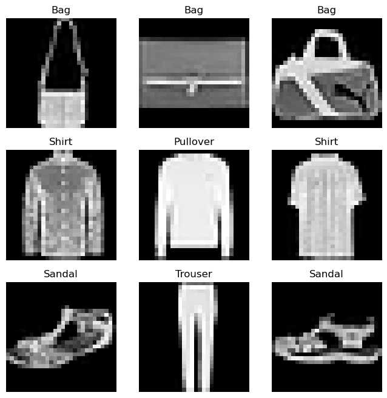
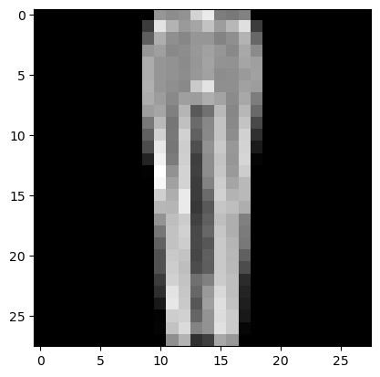

# PyTorch Tutorial Workthrough

Here we work through a basic example in PyTorch. It is the example used in the [PyTorch Tutorial](https://pytorch.org/tutorials/beginner/basics/intro.html). 


## Load some libraries


```python
import pandas as pd
import numpy as np
import torch
from torch.utils.data import Dataset
from torchvision import datasets
from torchvision.transforms import ToTensor
import matplotlib.pyplot as plt
```

## Tensors

The PyTorch library expects data inputs as tensors. For example, here we load some inflation data


```python
# Load the data
data = pd.read_csv('datasets/CPALTT01USM657N.csv')
data.tail()
data['DATE'] = pd.to_datetime(data['DATE'])
data.set_index('DATE', inplace=True)
data.rename(columns={'CPALTT01USM657N': 'inflation'})
```


<div>
<style scoped>
    .dataframe tbody tr th:only-of-type {
        vertical-align: middle;
    }

    .dataframe tbody tr th {
        vertical-align: top;
    }

    .dataframe thead th {
        text-align: right;
    }
</style>
<table border="1" class="dataframe">
  <thead>
    <tr style="text-align: right;">
      <th></th>
      <th>inflation</th>
    </tr>
    <tr>
      <th>DATE</th>
      <th></th>
    </tr>
  </thead>
  <tbody>
    <tr>
      <th>1960-01-01</th>
      <td>-0.340136</td>
    </tr>
    <tr>
      <th>1960-01-02</th>
      <td>0.341297</td>
    </tr>
    <tr>
      <th>1960-01-03</th>
      <td>0.000000</td>
    </tr>
    <tr>
      <th>1960-01-04</th>
      <td>0.340136</td>
    </tr>
    <tr>
      <th>1960-01-05</th>
      <td>0.000000</td>
    </tr>
    <tr>
      <th>...</th>
      <td>...</td>
    </tr>
    <tr>
      <th>2023-01-03</th>
      <td>0.331073</td>
    </tr>
    <tr>
      <th>2023-01-04</th>
      <td>0.505904</td>
    </tr>
    <tr>
      <th>2023-01-05</th>
      <td>0.251844</td>
    </tr>
    <tr>
      <th>2023-01-06</th>
      <td>0.322891</td>
    </tr>
    <tr>
      <th>2023-01-07</th>
      <td>0.190752</td>
    </tr>
  </tbody>
</table>
<p>763 rows × 1 columns</p>
</div>


These can be transformed into a tensor like so, where we use the `values()` property of the dataframe. The resulting tensor has properties `shape` and `type` which give you the relevant shape and type information.


```python
tensor = torch.tensor(data.values)
tensor.dtype
tensor.shape

```


    torch.Size([763, 1])


Tensors are basically multi-dimensional matrices and you can do arithmatic with these. Find a [list of operations](https://pytorch.org/docs/stable/torch.html) to see what is available. 

## Example data

To follow the example in the PyTorch tutorial we need to load the Fashion-MNIST dataset. This dataset is already in the right format and we obtain a training and a testing portion for the dataset.


```python
training_data = datasets.FashionMNIST(
    root="data",
    train=True,
    download=True,
    transform=ToTensor()
)

test_data = datasets.FashionMNIST(
    root="data",
    train=False,
    download=True,
    transform=ToTensor()
)
```

    Downloading http://fashion-mnist.s3-website.eu-central-1.amazonaws.com/train-images-idx3-ubyte.gz
    Downloading http://fashion-mnist.s3-website.eu-central-1.amazonaws.com/train-images-idx3-ubyte.gz to data\FashionMNIST\raw\train-images-idx3-ubyte.gz
    

    100%|██████████| 26421880/26421880 [00:00<00:00, 31078387.66it/s]
    

    Extracting data\FashionMNIST\raw\train-images-idx3-ubyte.gz to data\FashionMNIST\raw
    
    Downloading http://fashion-mnist.s3-website.eu-central-1.amazonaws.com/train-labels-idx1-ubyte.gz
    Downloading http://fashion-mnist.s3-website.eu-central-1.amazonaws.com/train-labels-idx1-ubyte.gz to data\FashionMNIST\raw\train-labels-idx1-ubyte.gz
    

    100%|██████████| 29515/29515 [00:00<00:00, 1424190.17it/s]
    

    Extracting data\FashionMNIST\raw\train-labels-idx1-ubyte.gz to data\FashionMNIST\raw
    
    Downloading http://fashion-mnist.s3-website.eu-central-1.amazonaws.com/t10k-images-idx3-ubyte.gz
    Downloading http://fashion-mnist.s3-website.eu-central-1.amazonaws.com/t10k-images-idx3-ubyte.gz to data\FashionMNIST\raw\t10k-images-idx3-ubyte.gz
    

    100%|██████████| 4422102/4422102 [00:00<00:00, 15802399.81it/s]
    

    Extracting data\FashionMNIST\raw\t10k-images-idx3-ubyte.gz to data\FashionMNIST\raw
    
    Downloading http://fashion-mnist.s3-website.eu-central-1.amazonaws.com/t10k-labels-idx1-ubyte.gz
    Downloading http://fashion-mnist.s3-website.eu-central-1.amazonaws.com/t10k-labels-idx1-ubyte.gz to data\FashionMNIST\raw\t10k-labels-idx1-ubyte.gz
    

    100%|██████████| 5148/5148 [00:00<?, ?it/s]

    Extracting data\FashionMNIST\raw\t10k-labels-idx1-ubyte.gz to data\FashionMNIST\raw
    
    

    
    

These are image data, for instance the first image `training_data[1]` gives you information on the 28x28 pixels of an image.


```python
training_data[1]
```


    (tensor([[[0.0000, 0.0000, 0.0000, 0.0000, 0.0000, 0.0039, 0.0000, 0.0000,
               0.0000, 0.0000, 0.1608, 0.7373, 0.4039, 0.2118, 0.1882, 0.1686,
               0.3412, 0.6588, 0.5216, 0.0627, 0.0000, 0.0000, 0.0000, 0.0000,
               0.0000, 0.0000, 0.0000, 0.0000],
              [0.0000, 0.0000, 0.0000, 0.0039, 0.0000, 0.0000, 0.0000, 0.1922,
               0.5333, 0.8588, 0.8471, 0.8941, 0.9255, 1.0000, 1.0000, 1.0000,
               1.0000, 0.8510, 0.8431, 0.9961, 0.9059, 0.6275, 0.1765, 0.0000,
               0.0000, 0.0000, 0.0000, 0.0000],
              [0.0000, 0.0000, 0.0000, 0.0000, 0.0000, 0.0549, 0.6902, 0.8706,
               0.8784, 0.8314, 0.7961, 0.7765, 0.7686, 0.7843, 0.8431, 0.8000,
               0.7922, 0.7882, 0.7882, 0.7882, 0.8196, 0.8549, 0.8784, 0.6431,
               0.0000, 0.0000, 0.0000, 0.0000],
              [0.0000, 0.0000, 0.0000, 0.0000, 0.0000, 0.7373, 0.8588, 0.7843,
               0.7765, 0.7922, 0.7765, 0.7804, 0.7804, 0.7882, 0.7686, 0.7765,
               0.7765, 0.7843, 0.7843, 0.7843, 0.7843, 0.7882, 0.7843, 0.8824,
               0.1608, 0.0000, 0.0000, 0.0000],
              [0.0000, 0.0000, 0.0000, 0.0000, 0.2000, 0.8588, 0.7804, 0.7961,
               0.7961, 0.8314, 0.9333, 0.9725, 0.9804, 0.9608, 0.9765, 0.9647,
               0.9686, 0.9882, 0.9725, 0.9216, 0.8118, 0.7961, 0.7961, 0.8706,
               0.5490, 0.0000, 0.0000, 0.0000],
              [0.0000, 0.0000, 0.0000, 0.0000, 0.4549, 0.8863, 0.8078, 0.8000,
               0.8118, 0.8000, 0.3961, 0.2941, 0.1843, 0.2863, 0.1882, 0.1961,
               0.1765, 0.2000, 0.2471, 0.4431, 0.8706, 0.7922, 0.8078, 0.8627,
               0.8784, 0.0000, 0.0000, 0.0000],
              [0.0000, 0.0000, 0.0000, 0.0000, 0.7843, 0.8706, 0.8196, 0.7961,
               0.8431, 0.7843, 0.0000, 0.2745, 0.3843, 0.0000, 0.4039, 0.2314,
               0.2667, 0.2784, 0.1922, 0.0000, 0.8588, 0.8078, 0.8392, 0.8235,
               0.9804, 0.1490, 0.0000, 0.0000],
              [0.0000, 0.0000, 0.0000, 0.0000, 0.9686, 0.8549, 0.8314, 0.8235,
               0.8431, 0.8392, 0.0000, 0.9961, 0.9529, 0.5451, 1.0000, 0.6824,
               0.9843, 1.0000, 0.8039, 0.0000, 0.8431, 0.8510, 0.8392, 0.8157,
               0.8627, 0.3725, 0.0000, 0.0000],
              [0.0000, 0.0000, 0.0000, 0.1765, 0.8863, 0.8392, 0.8392, 0.8431,
               0.8784, 0.8039, 0.0000, 0.1647, 0.1373, 0.2353, 0.0627, 0.0667,
               0.0471, 0.0510, 0.2745, 0.0000, 0.7412, 0.8471, 0.8314, 0.8078,
               0.8314, 0.6118, 0.0000, 0.0000],
              [0.0000, 0.0000, 0.0000, 0.6431, 0.9216, 0.8392, 0.8275, 0.8627,
               0.8471, 0.7882, 0.2039, 0.2784, 0.3490, 0.3686, 0.3255, 0.3059,
               0.2745, 0.2980, 0.3608, 0.3412, 0.8078, 0.8118, 0.8706, 0.8353,
               0.8588, 0.8157, 0.0000, 0.0000],
              [0.0000, 0.0000, 0.0000, 0.4157, 0.7333, 0.8745, 0.9294, 0.9725,
               0.8275, 0.7765, 0.9882, 0.9804, 0.9725, 0.9608, 0.9725, 0.9882,
               0.9922, 0.9804, 0.9882, 0.9373, 0.7882, 0.8314, 0.8824, 0.8431,
               0.7569, 0.4431, 0.0000, 0.0000],
              [0.0000, 0.0000, 0.0000, 0.0000, 0.0000, 0.0667, 0.2118, 0.6235,
               0.8706, 0.7569, 0.8157, 0.7529, 0.7725, 0.7843, 0.7843, 0.7843,
               0.7843, 0.7882, 0.7961, 0.7647, 0.8235, 0.6471, 0.0000, 0.0000,
               0.0000, 0.0000, 0.0000, 0.0000],
              [0.0000, 0.0000, 0.0000, 0.0000, 0.0000, 0.0000, 0.0000, 0.1843,
               0.8824, 0.7529, 0.8392, 0.7961, 0.8078, 0.8000, 0.8000, 0.8039,
               0.8078, 0.8000, 0.8314, 0.7725, 0.8549, 0.4196, 0.0000, 0.0000,
               0.0000, 0.0000, 0.0000, 0.0000],
              [0.0000, 0.0000, 0.0000, 0.0000, 0.0039, 0.0235, 0.0000, 0.1804,
               0.8314, 0.7647, 0.8314, 0.7922, 0.8078, 0.8039, 0.8000, 0.8039,
               0.8078, 0.8000, 0.8314, 0.7843, 0.8549, 0.3569, 0.0000, 0.0118,
               0.0039, 0.0000, 0.0000, 0.0000],
              [0.0000, 0.0000, 0.0000, 0.0000, 0.0000, 0.0039, 0.0000, 0.0431,
               0.7725, 0.7804, 0.8039, 0.7922, 0.8039, 0.8078, 0.8000, 0.8039,
               0.8118, 0.8000, 0.8039, 0.8039, 0.8549, 0.3020, 0.0000, 0.0196,
               0.0000, 0.0000, 0.0000, 0.0000],
              [0.0000, 0.0000, 0.0000, 0.0000, 0.0000, 0.0118, 0.0000, 0.0078,
               0.7490, 0.7765, 0.7882, 0.8039, 0.8078, 0.8039, 0.8039, 0.8078,
               0.8196, 0.8078, 0.7804, 0.8196, 0.8588, 0.2902, 0.0000, 0.0196,
               0.0000, 0.0000, 0.0000, 0.0000],
              [0.0000, 0.0000, 0.0000, 0.0000, 0.0000, 0.0078, 0.0000, 0.0000,
               0.7373, 0.7725, 0.7843, 0.8118, 0.8118, 0.8000, 0.8118, 0.8118,
               0.8235, 0.8157, 0.7765, 0.8118, 0.8667, 0.2824, 0.0000, 0.0157,
               0.0000, 0.0000, 0.0000, 0.0000],
              [0.0000, 0.0000, 0.0000, 0.0000, 0.0000, 0.0078, 0.0000, 0.0000,
               0.8431, 0.7765, 0.7961, 0.8078, 0.8157, 0.8039, 0.8118, 0.8118,
               0.8235, 0.8157, 0.7843, 0.7922, 0.8706, 0.2941, 0.0000, 0.0157,
               0.0000, 0.0000, 0.0000, 0.0000],
              [0.0000, 0.0000, 0.0000, 0.0000, 0.0000, 0.0039, 0.0000, 0.0000,
               0.8314, 0.7765, 0.8196, 0.8078, 0.8196, 0.8078, 0.8157, 0.8118,
               0.8275, 0.8078, 0.8039, 0.7765, 0.8667, 0.3137, 0.0000, 0.0118,
               0.0000, 0.0000, 0.0000, 0.0000],
              [0.0000, 0.0000, 0.0000, 0.0000, 0.0000, 0.0039, 0.0000, 0.0000,
               0.8000, 0.7882, 0.8039, 0.8157, 0.8118, 0.8039, 0.8275, 0.8039,
               0.8235, 0.8235, 0.8196, 0.7647, 0.8667, 0.3765, 0.0000, 0.0118,
               0.0000, 0.0000, 0.0000, 0.0000],
              [0.0000, 0.0000, 0.0000, 0.0000, 0.0000, 0.0039, 0.0000, 0.0000,
               0.7922, 0.7882, 0.8039, 0.8196, 0.8118, 0.8039, 0.8353, 0.8078,
               0.8235, 0.8196, 0.8235, 0.7608, 0.8510, 0.4118, 0.0000, 0.0078,
               0.0000, 0.0000, 0.0000, 0.0000],
              [0.0000, 0.0000, 0.0000, 0.0000, 0.0000, 0.0039, 0.0000, 0.0000,
               0.8000, 0.8000, 0.8039, 0.8157, 0.8118, 0.8039, 0.8431, 0.8118,
               0.8235, 0.8157, 0.8275, 0.7569, 0.8353, 0.4510, 0.0000, 0.0078,
               0.0000, 0.0000, 0.0000, 0.0000],
              [0.0000, 0.0000, 0.0000, 0.0000, 0.0000, 0.0000, 0.0000, 0.0000,
               0.8000, 0.8118, 0.8118, 0.8157, 0.8078, 0.8078, 0.8431, 0.8235,
               0.8235, 0.8118, 0.8314, 0.7647, 0.8235, 0.4627, 0.0000, 0.0078,
               0.0000, 0.0000, 0.0000, 0.0000],
              [0.0000, 0.0000, 0.0000, 0.0000, 0.0000, 0.0039, 0.0000, 0.0000,
               0.7765, 0.8157, 0.8157, 0.8157, 0.8000, 0.8118, 0.8314, 0.8314,
               0.8235, 0.8118, 0.8275, 0.7686, 0.8118, 0.4745, 0.0000, 0.0039,
               0.0000, 0.0000, 0.0000, 0.0000],
              [0.0000, 0.0000, 0.0000, 0.0000, 0.0000, 0.0039, 0.0000, 0.0000,
               0.7765, 0.8235, 0.8118, 0.8157, 0.8078, 0.8196, 0.8353, 0.8314,
               0.8275, 0.8118, 0.8235, 0.7725, 0.8118, 0.4863, 0.0000, 0.0039,
               0.0000, 0.0000, 0.0000, 0.0000],
              [0.0000, 0.0000, 0.0000, 0.0000, 0.0000, 0.0000, 0.0000, 0.0000,
               0.6745, 0.8235, 0.7961, 0.7882, 0.7804, 0.8000, 0.8118, 0.8039,
               0.8000, 0.7882, 0.8039, 0.7725, 0.8078, 0.4980, 0.0000, 0.0000,
               0.0000, 0.0000, 0.0000, 0.0000],
              [0.0000, 0.0000, 0.0000, 0.0000, 0.0000, 0.0000, 0.0000, 0.0000,
               0.7373, 0.8667, 0.8392, 0.9176, 0.9255, 0.9333, 0.9569, 0.9569,
               0.9569, 0.9412, 0.9529, 0.8392, 0.8784, 0.6353, 0.0000, 0.0078,
               0.0000, 0.0000, 0.0000, 0.0000],
              [0.0000, 0.0000, 0.0000, 0.0000, 0.0000, 0.0039, 0.0000, 0.0000,
               0.5451, 0.5725, 0.5098, 0.5294, 0.5294, 0.5373, 0.4902, 0.4863,
               0.4902, 0.4745, 0.4667, 0.4471, 0.5098, 0.2980, 0.0000, 0.0000,
               0.0000, 0.0000, 0.0000, 0.0000]]]),
     0)


We can also visualise these images


```python
labels_map = {
    0: "T-Shirt",
    1: "Trouser",
    2: "Pullover",
    3: "Dress",
    4: "Coat",
    5: "Sandal",
    6: "Shirt",
    7: "Sneaker",
    8: "Bag",
    9: "Ankle Boot",
}
figure = plt.figure(figsize=(8, 8))
cols, rows = 3, 3
for i in range(1, cols * rows + 1):
    sample_idx = torch.randint(len(training_data), size=(1,)).item()
    img, label = training_data[sample_idx]
    figure.add_subplot(rows, cols, i)
    plt.title(labels_map[label])
    plt.axis("off")
    plt.imshow(img.squeeze(), cmap="gray")
plt.show()
```


    

    


We now have the data avaialable in `test_data` and `training_data`. For certain operations it will turn out to be useful to access the data via the DataLoader. This will enable access samples of data.


```python
from torch.utils.data import DataLoader

train_dataloader = DataLoader(training_data, batch_size=64, shuffle=True)
test_dataloader = DataLoader(test_data, batch_size=64, shuffle=True)
```

We indicated above that, if iterating through the data, we get random items. Each item has an image and a label.


```python
train_features, train_labels = next(iter(train_dataloader))
print(f"Feature batch shape: {train_features.size()}")
print(f"Labels batch shape: {train_labels.size()}")
img = train_features[0].squeeze()
label = train_labels[0]
plt.imshow(img, cmap="gray")
plt.show()
print(f"Label: {label}")
```

    Feature batch shape: torch.Size([64, 1, 28, 28])
    Labels batch shape: torch.Size([64])
    


    

    


    Label: 1
    


```python
img, label = training_data[11]
```
